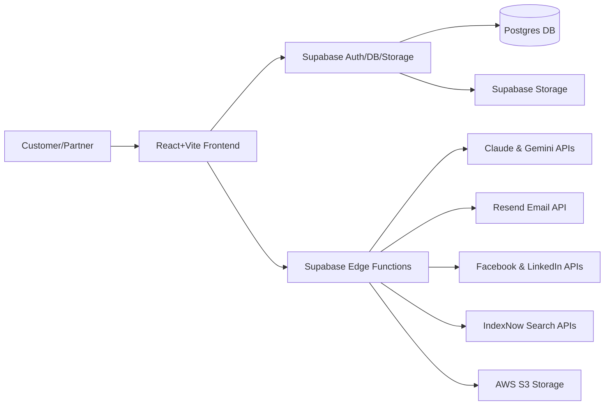

## Microns Hub – On‑Demand Manufacturing Platform

Microns Hub is a full‑stack, AI‑powered **on‑demand manufacturing platform** that connects engineers and product teams with high‑quality CNC machining, sheet metal fabrication, 3D printing, and injection molding partners.

It solves a very common manufacturing problem:

- **Slow, manual quoting** for custom parts  
- **Fragmented communication** between customers and suppliers  
- **Limited international reach and SEO** for lead generation  

This project automates quoting, content, translations, and distribution so that a small team can operate a modern, multi‑language manufacturing marketplace.

---

## Problem the App Solves

- **For customers**:  
  - Get quotes for complex parts with CAD uploads and detailed manufacturing requirements.  
  - Track orders and RFQs in a modern web dashboard.  

- **For manufacturing partners**:  
  - Receive qualified RFQs, manage jobs, and update production status through a dedicated partner dashboard.  

- **For the business**:  
  - Automatically generate technical blog content, translate it into 10+ languages, update sitemaps, and push new posts to social media – a full SEO and lead‑generation machine on autopilot.

---

## Key Features

- **Multi‑step quote and RFQ flows** with CAD file upload and validation  
- **Customer dashboard** for orders, RFQs, and status tracking  
- **Partner dashboard** with role‑based authentication (`partner_seller`)  
- **Automated content pipeline**:
  - Daily AI‑generated English articles (Claude)  
  - Automatic translation into 10+ languages (Gemini)  
  - Table‑aware translation that preserves complex HTML tables  
  - Automatic link fixing and sitemap regeneration  
  - IndexNow ping to search engines  
- **Multi‑language SEO**:
  - Language‑prefixed routes (`/{lang}/services`, `/{lang}/blog/{slug}`)  
  - Hreflang tags, canonical URLs, structured data  
  - Localized service URLs and blog links  
- **Email system**:
  - Transactional emails for quotes and RFQs  
  - Marketing campaigns with tagging and A/B subject testing  
- **Social media automation**:
  - Post blog articles to Facebook and LinkedIn  
  - AI‑generated hashtags tailored to each article  

---

## Tech Stack

### Frontend

- **React 18** + **TypeScript**
- **Vite** as the build tool
- **React Router v6** for routing and language‑aware URLs
- **Tailwind CSS 3** for utility‑first styling
- **shadcn/ui** built on **Radix UI** primitives for accessible components
- **React Query (TanStack Query)** for server state and caching
- **React Hook Form**, **Formik**, **Yup**, **Zod** for forms and validation
- **i18next** + **react‑i18next** for 10+ language internationalization
- **React Quill** as a rich‑text / blog editor
- **Recharts** for analytics and dashboards
- **Three.js** + **@react‑three/fiber** + **@react‑three/drei** for 3D/CAD visualizations

### Backend / Platform

- **Supabase** (Postgres + Auth + Storage + Edge Functions)
  - Postgres database with row‑level security
  - Supabase Auth for users and partners
  - Supabase Storage for storing attachments and RFQ files
  - **18+ Edge Functions** (Deno) for serverless backend logic:
    - Article generation and translation
    - Sitemap generation and updates
    - Email sending and marketing campaigns
    - Partner onboarding and password management
    - Social media posting

### AI & Automation

- **Anthropic Claude Sonnet 4**  
  - Automated article generation with silo structure, internal linking, and SEO prompts
- **Google Gemini 2.0 Flash**  
  - Multi‑language article translation (10+ languages)  
  - Custom **continuation loop** for handling max‑token limits  
  - **Rate‑limit aware** retry with exponential backoff (429 handling)
- **Automation via Supabase + cron**:
  - Daily article queue processing
  - Scheduled translation and link‑fix runs
  - Periodic sitemap regeneration

### External Services

- **AWS S3** for CAD and heavy file storage (presigned URL uploads/downloads)
- **Resend** for transactional and marketing email delivery
- **Facebook Graph API** for Facebook page posting
- **LinkedIn UGC API** for company feed posts
- **IndexNow** (Bing and other engines) for instant indexing of new content

---

## High‑Level Architecture



---

## Notable Technical Achievements

- **AI‑driven content engine**:
  - Generates SEO‑optimized manufacturing articles with Claude
  - Automatically translates them into many languages with Gemini
  - Preserves complex HTML table structures during translation with a custom
    table‑extraction and reinsertion pipeline

- **Robust translation pipeline**:
  - Continuation loop to bypass token limits
  - Length‑ratio checks to detect truncated output
  - Retry logic for languages with complex grammar (e.g. Hungarian, Finnish, Polish, Czech)
  - Table batch translation for performance (translates all tables in one API call)

- **Rate‑limit handling**:
  - Exponential backoff for Gemini 429 responses in the Edge Function
  - Additional batch delays and user feedback in the frontend

- **End‑to‑end SEO automation**:
  - Automatic sitemap generation (full + language‑specific)
  - IndexNow submission of new URLs
  - Language‑aware link rewriting in translated content

- **Full partner network feature set** (backed by Supabase Auth and custom roles)
  - Partner onboarding and credential management
  - Partner‑only dashboards and restricted access

---

## Project Structure (High‑Level)

Some key directories:

- `src/pages/` – Public pages (landing, services, blog, quote, RFQ) and dashboard routes  
- `src/components/` – Shared UI components (shadcn/ui, layout, forms, tables)  
- `src/components/dashboard/` – Admin, customer, and partner dashboards  
- `supabase/functions/` – Edge Functions (article generation, translation, sitemap, email, social)  
- `supabase/migrations/` – Database schema and migration scripts  

---

## Getting Started

### Prerequisites

- Node.js (LTS) and npm  
- Supabase project (for Postgres, Auth, Storage, Edge Functions)  
- Accounts/keys for:
  - Anthropic (Claude)
  - Google AI Studio (Gemini)
  - Resend
  - AWS (S3)
  - Facebook Developer + LinkedIn Developer (optional, for social posting)

### Installation

```bash
git clone https://github.com/dimitrisvard/on-demand-craft-greece.git
cd on-demand-craft-greece

npm install
```

### Environment Variables

Create a `.env` file in the project root (values are examples, not real keys):

```bash
VITE_SUPABASE_URL=https://your-project-ref.supabase.co
VITE_SUPABASE_ANON_KEY=your_supabase_anon_key

SUPABASE_URL=https://your-project-ref.supabase.co
SUPABASE_SERVICE_ROLE_KEY=your_service_role_key

GEMINI_API_KEY=your_gemini_api_key
ANTHROPIC_API_KEY=your_claude_api_key

RESEND_API_KEY=your_resend_api_key

AWS_ACCESS_KEY_ID=your_aws_key
AWS_SECRET_ACCESS_KEY=your_aws_secret
AWS_S3_BUCKET=your_s3_bucket

FACEBOOK_PAGE_ID=your_fb_page_id
FACEBOOK_ACCESS_TOKEN=your_fb_page_token

LINKEDIN_ORG_ID=your_linkedin_org_id
LINKEDIN_ACCESS_TOKEN=your_linkedin_token

SITE_URL=https://www.micronshub.eu
INDEXNOW_KEY=your_indexnow_key
```

### Run the App in Development

```bash
npm run dev
```

The frontend will start on the Vite dev server (typically `http://localhost:5173`).

### Build for Production

```bash
npm run build
```

This outputs a production build to `dist/`.

---

## Why This Project Is Strong for a CV

- Demonstrates **end‑to‑end product thinking**: from quoting and partner management to marketing and SEO.  
- Uses a **modern React + TypeScript + Tailwind + shadcn** stack with good architectural separation.  
- Shows **real‑world AI integration** (Claude + Gemini) with robust error handling and rate‑limit aware design.  
- Leverages **Supabase** as a backend platform, including Postgres, Auth, Storage, and Edge Functions.  
- Implements **multi‑language SEO, automation, and social media distribution**, which are rare and highly valued skills.  

If you are using this repository as part of your portfolio/CV, you can confidently present it as a **production‑ready, AI‑augmented manufacturing platform** with a thoughtful architecture and a rich feature set.
