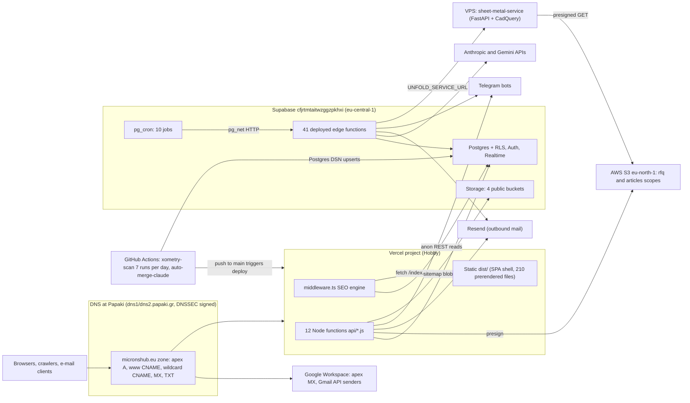
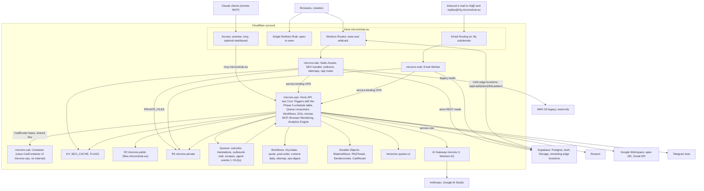
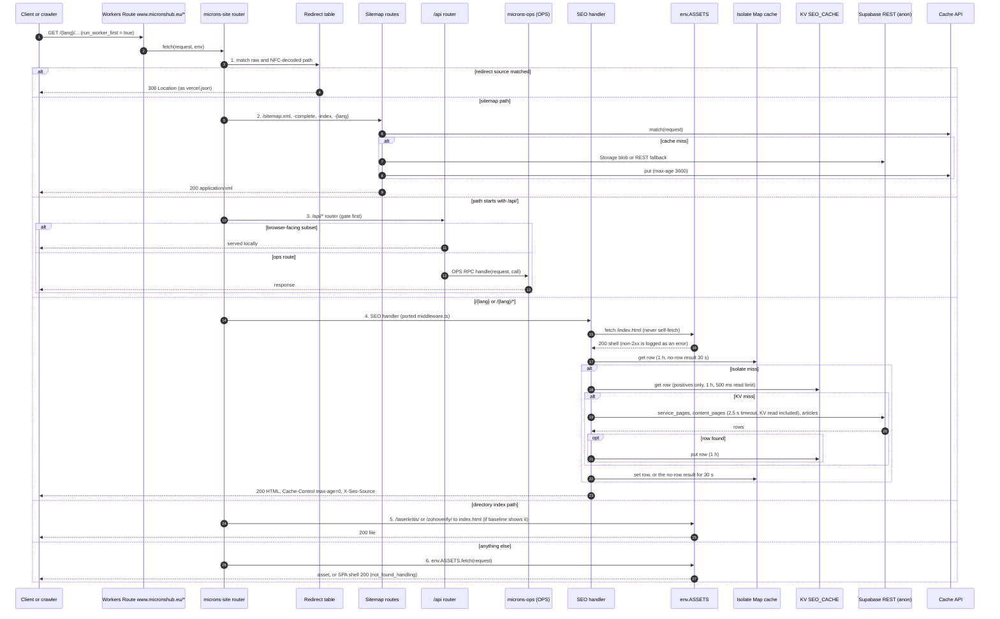
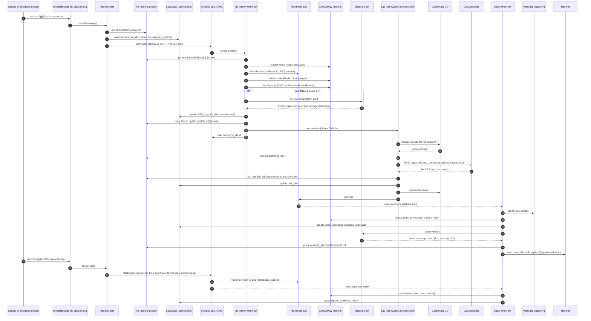
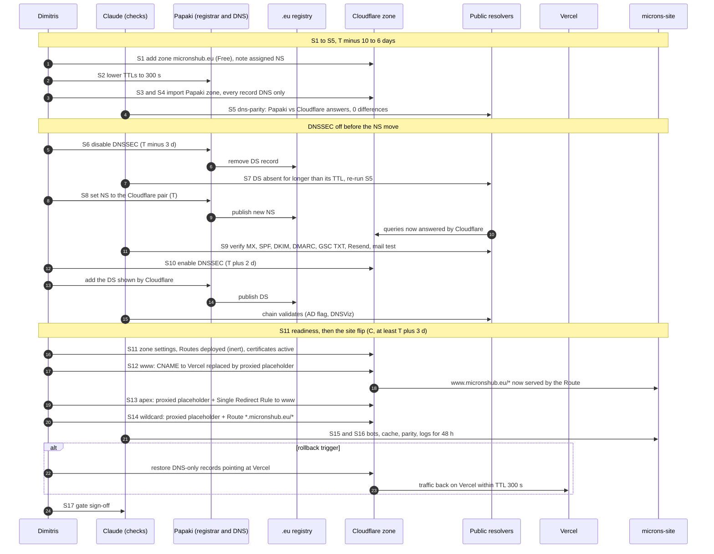
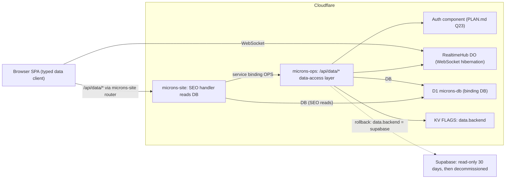

# Microns Hub on Cloudflare: target architecture

Status: Phase 0 planning deliverable · 2026-09-30 · nothing here is deployed.

Related: [README.md](README.md) · [PLAN.md](PLAN.md) · [INVENTORY.md](INVENTORY.md) · [inventory.csv](inventory.csv) · [wrangler.jsonc.draft](wrangler.jsonc.draft) · [SEO_PARITY.md](SEO_PARITY.md) · [AGENTS.md](AGENTS.md) · [RISKS.md](RISKS.md) · [COSTS.md](COSTS.md)

This file is brief §7 item 3: the target design (diagrams, Worker layout, bindings, R2 layout, Queues, Workflows, Durable Objects, AI Gateway routes, Access policies, hostnames, DNS/DNSSEC procedure). Tasks, gates and owners live in [PLAN.md](PLAN.md); agent behaviour in [AGENTS.md](AGENTS.md); the draft configuration in [wrangler.jsonc.draft](wrangler.jsonc.draft).

Evidence tags: `path:line` = this repository at commit `9afcba8`; "live 2026-09-30" = read-only re-capture of Supabase, Vercel and DNS; "CF docs (verified 2026-09-27)" = Cloudflare documentation checked during planning; "CF docs, re-check at execution" = not verified during planning; "list price, re-check at execution" = prices.

Security findings appear at summary level only. Details: private security note (delivered to the owner out of band, not in this public repo).

Phase 4 build (2026-10-07): §3, §5, §6.4, §7, §8–§14, §16–§20 and §23 are brought in line with the agent layer as built ([PLAN.md](PLAN.md) §5.4, deviations DC-1…DC-19); nothing is deployed. Cloudflare now titles Email Routing "Email Service" and Browser Rendering "Browser Run"; these documents keep the old names (DC-15).

Phase 5 build (2026-10-09): §2 (edge-function count), §3, §6.4, §7, §8–§13, §16–§20 and §23 are brought in line with the consolidated compute as built ([PLAN.md](PLAN.md) §5.5, deviations DV5-1…DV5-22, build amendments BA5-1…BA5-10); nothing is deployed, applied or switched.

## 1. Decisions in one table

| # | Decision | Reason | Evidence |
|---|---|---|---|
| 1 | Three Workers (`microns-site`, `microns-ops`, `microns-mail`) and one Container app (`microns-cad`) | Blast radius, bundle size, deploy gating by the parity diff (§4) | H-18, H-27 |
| 2 | `microns-site` answers every request first (`run_worker_first: true`, `html_handling: "none"`) | Prerendered files must stay shadowed like on Vercel; no trailing-slash redirects | H-3, H-8; CF docs (verified 2026-09-27) |
| 3 | Shell via `env.ASSETS.fetch(new URL('/index.html', url))`, never a self-fetch | Workers refuse self-fetch; today middleware.ts:424 fetches its own origin | H-4 |
| 4 | Redirect table inside the Worker, not `_redirects` | 308 like Vercel, NFC-decoded matching, runs before the SEO handler | vercel.json:2-128; H-3, H-11 |
| 5 | `/api/*` split: browser-facing subset local, the rest over service binding `OPS` | Keeps `lib/inventory`, nesting, `@aws-sdk`-class code out of the SEO Worker | H-27 |
| 6 | Two R2 buckets, `microns-public` and `microns-private`; legacy S3 read-only | A public custom domain can never expose customer files; 755 persisted S3 image URLs | H-17; live 2026-09-30 |
| 7 | Workers Route (not Custom Domain) for `www` and `*.micronshub.eu` | Rollback is one record flip; Custom Domains do not support wildcards or existing CNAMEs | CF docs (verified 2026-09-27) |
| 8 | Supabase stays the system of record for Phases 0–6 | Brief §2 item 3; optional Phase 7 sketch in §22 | Owner decision 2026-09-30 |
| 9 | Agents are flag-gated Workflows and Durable Objects with Telegram and dashboard approval | Brief §4; every run is an `agent_runs` row | [AGENTS.md](AGENTS.md) |
| 10 | Every LLM call goes through AI Gateway `microns` with role-based routes | Cost per agent, spend limit, logs, BYOK | §13 |

## 2. Current state (live 2026-09-30)

| Component | Where it runs today | Evidence |
|---|---|---|
| SPA, 210 prerendered files, SEO middleware, 12 API functions | Vercel project `prj_jsmi2AIFypu8dPv2AQBxyWyFhSKZ` (Hobby) | vite.config.ts:27-50; middleware.ts:682-687; live 2026-09-30 |
| Postgres, Auth, Realtime, Storage (4 public buckets), 41 edge functions (16 without repo source; first counted as 40, PLAN.md §5.5 DV5-8), 10 pg_cron jobs | Supabase `cfjrtmtaitwzggzpkhxi`, eu-central-1 | live 2026-09-30 |
| `sheet-metal-service` (`/flat-pattern`, `/api/v1/unfold*`) | VPS, host not recorded in the repo (PLAN.md Q2) | sheet-metal-service/main.py:243, :445 |
| Xometry scanner | GitHub Actions, `0 6,8,10,12,14,16,18 * * *` | .github/workflows/xometry-scan.yml:21 |
| Files | AWS S3 eu-north-1 (`rfq`, `articles` scopes) + Supabase Storage | api/s3.js:33-65; live 2026-09-30 |
| LLM calls | Supabase edge functions direct to providers | supabase/functions/generate-daily-article/index.ts:184; supabase/functions/translate-article/index.ts:104 |

## 3. Target state (end of Phase 5)

What stays outside Cloudflare: Supabase (system of record, Auth, the auth-bound edge functions listed in [PLAN.md](PLAN.md) §5.5), Resend, Google Workspace MX and Gmail API senders, Telegram bots, GA4/Google Ads tags in `index.html`, and the legacy S3 buckets (read-only). As built in Phase 5, Supabase Storage keeps serving `sitemap-complete.xml`, which `SitemapWorkflow` writes (DV5-1); the ported edge functions stay deployed for their manual callers, and the VPS and the Python Action stay as rollback paths until Phase 6.

## 4. Why three Workers and one Container app

| Option | Blast radius of an agent or API deploy | SEO Worker bundle | Deploy gating | CPU-heavy work | Verdict |
|---|---|---|---|---|---|
| One Worker (brief §3) | Any deploy can break SEO pages | ≈ 1.7 MB locale JSON + `@aws-sdk` + `pdf-lib` + nesting + agents | Every change needs the full parity run | Shares limits with page serving | Rejected |
| Site + one API Worker | API deploys isolated; agents still share the API Worker | Small | Parity only on site changes | Mixed with request handlers | Workable, but Cron/Queue/Workflow code would share the API deploy |
| **Three Workers + Container** | `microns-site` changes only for SEO/router/browser-API work; agents, crons and CAD deploy elsewhere | Small: SEO handler, redirects, sitemaps, thin local API | `microns-site` deploys only after parity = 0 unexplained diffs; `microns-ops`/`microns-mail`/`microns-cad` have their own tests | Container and DOs with raised `cpu_ms` | **Chosen** |

Rules that follow from the split:

| Rule | Detail |
|---|---|
| One repository, four folders | `workers/site`, `workers/ops`, `workers/mail`, `workers/cad`; one pinned `wrangler` version (H-23). Since Phase 2 also `workers/shared`: source-only code (the `@vercel/node` shim, HTTP helpers, auth and storage primitives) that both Workers import by relative path; each package keeps its own lockfile, the root lockfile is unchanged |
| Service binding, not public HTTP | `microns-site` and `microns-mail` call `microns-ops` through binding `OPS`; `microns-ops` has no public hostname except `mcp.micronshub.eu` |
| Contract between site and ops | RPC to the named entrypoint `OpsApi`: `handle(request, call)`. The request keeps method, path, query and body, without cookies, Access headers, `x-microns-*` and hop-by-hop headers; `call` carries the endpoint, action, function URL and the verified caller, and ops reads the caller only from `call`. The default `fetch` of `microns-ops` answers 404; ops never renders HTML |
| Independent rollback | `microns-site` rolls back by version (`wrangler rollback`) or record flip; agents by flag in KV `FLAGS`; ops by version |

## 5. Hostnames (canonical)

| Host | Today | Target (Phase 3) |
|---|---|---|
| `www.micronshub.eu` | Vercel (CNAME) | Workers Route `www.micronshub.eu/*` → `microns-site` on a proxied placeholder record (not a Custom Domain; rollback = record flip) |
| `micronshub.eu` (apex) | Vercel domain redirect to www (`redirectStatusCode: null` → status from baseline) | Single Redirect Rule → `https://www.micronshub.eu${path}${query}` with the status seen in the baseline |
| `*.micronshub.eu` | wildcard CNAME to Vercel (tenant subdomains) | proxied wildcard record + Workers Route `*.micronshub.eu/*` → `microns-site` (more specific routes win) |
| `files.micronshub.eu` | — | R2 custom domain for `microns-public` |
| `mcp.micronshub.eu` | — | Custom Domain → `microns-ops` (remote MCP at `/mcp`, stateless handler in the default `fetch`); Access "MCP server" application with Managed OAuth (Phase 4) |
| `api.micronshub.eu` | caught by wildcard CNAME | Machine-caller host for `tender-collector` and the local MCP server, served by `microns-site` behind Access application `microns-machine-api`; added to `API_MACHINE_HOSTS` by the Phase 3 runbook before the `www` flip ([PLAN.md](PLAN.md) §5.2 D-3) |
| `rfq.micronshub.eu` | caught by wildcard CNAME | Email Routing subdomain (MX/TXT added by CF); addresses `rfq@`, `replies@` → `microns-mail` |
| preview | — | `microns-site.<account>.workers.dev` + `wrangler versions upload --preview-alias staging`; Access (service token for CI tools); `X-Robots-Tag: noindex` on every non-production host |

| Hostname note | Detail | Evidence |
|---|---|---|
| Apex e-mail links | Sent e-mails embed apex URLs (`/api/marketing?action=track…`, `/logo.png`); the apex redirect must preserve path and query exactly | api/emails.js:165; supabase/functions/send-campaign/index.ts:8; H-24 |
| `rfq.` after Email Routing | Once MX/TXT exist at `rfq`, the wildcard CNAME no longer answers for that name; nothing browses `rfq.` today | live 2026-09-30 (wildcard answers `rfq.`) |
| `_vercel.` | Answered by the wildcard today; kept until Vercel is decommissioned (Phase 6) | live 2026-09-30 |
| Route precedence | Routes run in front of Custom Domains, so `*.micronshub.eu/*` would also catch `mcp.` and `files.`; at S11, routes `mcp.micronshub.eu/*` and `files.micronshub.eu/*` without a Worker are added (or the router passes those hosts through). `www.micronshub.eu/*` wins over the wildcard as the more specific pattern | CF docs (verified 2026-09-30, [wrangler.jsonc.draft](wrangler.jsonc.draft)) |
| `on-demand-craft-greece.vercel.app` | Duplicate host serving the same site; used only as the server-side target of the `/api` forward (var `API_FORWARD_ORIGIN` from Phase 2: the forward refuses its own host once `www` routes to the Worker), never linked | live 2026-09-30; [PLAN.md](PLAN.md) §5.2 |
| `api.` label | Reserved by the tenant resolver, so it never resolves to a tenant | src/utils/tenantApi.ts:29-51 (§15) |

## 6. `microns-site`

### 6.1 Static Assets configuration

| Setting | Value | Why | Evidence |
|---|---|---|---|
| `assets.directory` | `../../dist` (from `workers/site`) | Same Vite output as Vercel | vite.config.ts:27-50 |
| `assets.binding` | `ASSETS` | Shell and fallback fetches | H-4 |
| `html_handling` | `"none"` | Default `auto-trailing-slash` would 307 `/index.html` → `/` and `/en` → `/en/`; `none` serves exact file paths only | CF docs (verified 2026-09-27); H-10 |
| `not_found_handling` | `"single-page-application"` | Unknown paths get the shell with 200, as Vercel's `/(.*)` → `/index.html` rewrite | vercel.json:159-161; H-9 |
| `run_worker_first` | `true` | The Worker is the router for every path, as middleware + rewrites are on Vercel; can be narrowed to globs later for cost | CF docs (verified 2026-09-27); H-8 |
| `public/_redirects` | Deleted in Phase 1 | `/* /index.html 200` would be applied by the asset layer to every delegated request, including `/assets/*` | public/_redirects:1; H-3 |
| `compatibility_flags` | `["nodejs_compat"]`, `compatibility_date` `2026-09-01` (≥ 2025-04-01) | `Buffer`, `node:crypto`, `process.env` population for the shimmed handlers | H-20 |

### 6.2 Router order

| Step | Matches | Action | Why this position |
|---|---|---|---|
| 1 | Redirect table: 25 `vercel.json` sources + 3 client-only sources (src/components/SEORedirects.tsx:14-73), matched on the raw and the NFC-decoded pathname | 308 with the same `Location` as Vercel; the dead mojibake source (vercel.json:58-62) kept byte-identical; the 3 client-only entries become server 308s (documented parity deviation, [PLAN.md](PLAN.md) P1-5) | Some sources sit inside the language matcher (`/en/dawycena`, vercel.json:68-72); they must redirect before the SEO handler answers 200 |
| 2 | `/sitemap.xml`, `/sitemap-complete.xml`, `/sitemap-index.xml`, then `/sitemap-{lang}.xml`, and `/api/sitemap` | Port of `api/sitemap.js` (`type` = `main-index`, default, `index`, `lang`; api/sitemap.js:402-409); headers as api/sitemap.js:392-396; Cache API 1 h | Exact names are checked before the `{lang}` pattern because `index` and `complete` also match it (Vercel evaluates the rewrites in order, vercel.json:131-145); H-12 |
| 3 | `/api/*` | Local handler, `OPS` RPC, or Vercel forward when flag `api.forward_to_vercel` is on or the path is outside the `/api` catalogue (§6.4) | Independent of HTML rendering; `/api/track` and `/api/connector-status` aliases resolved here (vercel.json:151-157) |
| 4 | `/{lang}` and `/{lang}/*` for the 14 languages (middleware.ts:682-687) | SEO handler: copy of the `middleware.ts` orchestrator; `middleware/*` imported unchanged | H-8: the 210 prerendered files differ from the injected shell (Helmet head, `og:locale` `en`, no `#seo-content`) and must never be served for language routes; `src/main.tsx:7` renders without hydration |
| 5 | `/laserkritis/`, `/zohoverify/` (only if the P0-3 baseline shows Vercel serving the directory index; var `DIRECTORY_INDEX_EMULATION`, `"true"` in Phase 1) | `env.ASSETS.fetch` of `<path>index.html` | `html_handling: "none"` serves exact file paths only |
| 6 | Everything else | `env.ASSETS.fetch(request)`: asset, or SPA shell 200 | Same as Vercel's filesystem + `/(.*)` fallback; `/` and unprefixed legacy routes stay 200 shells (H-9) |

Router rules (as built in Phase 1: `workers/site/src/index.ts`, `src/sitemap.ts`, `src/compat/vercel-shim.ts`):

| Rule | Detail | Why |
|---|---|---|
| Error policy | A throw in any step answers `500` `text/plain` (`Internal Server Error`), logged with the step and the path. One exception: a throw in step 2 on `/api/sitemap` is logged and the request continues to step 3 (Phase 1: the forward to Vercel). A `null` from step 4 is not an error: it continues to steps 5–6 exactly where middleware.ts returns `undefined`, including after a logged shell failure | Vercel answers a crashing Function (the `/sitemap*.xml` rewrites) or Middleware with a 5xx (`FUNCTION_INVOCATION_FAILED`, `MIDDLEWARE_INVOCATION_FAILED`), never the shell or the prerendered file (H-8; a non-XML `/sitemap*.xml` answer is a rollback trigger, [SEO_PARITY.md](SEO_PARITY.md) §10.3) |
| HEAD on static files | Steps 5–6 fetch the asset as GET, count the bytes as they stream (not buffered) and set `Content-Length`; `finalise()` drops the body. An answer without a body, or one that already has `Content-Length`, passes unchanged. SEO documents (step 4) get no `Content-Length` on HEAD: it is not compared, and Vercel's value is unknown | Under `wrangler dev` 4.145.0 workerd sends no `Content-Length` on HEAD, not even for `env.ASSETS`' own HEAD answer; Vercel sends the file size and the parity tool compares it on G8 #10 (`/occt-import-js.wasm`, 7,604,031 B). Re-check on the preview |
| Sitemap query merge | The rewrite destination's query (with the raw `:lang` capture) is overridden key by key by the request's query; the function's `req.url` lists the request's keys first, then the rewrite-only keys; keys and values are percent-decoded and re-encoded with `encodeURIComponent` (so `/sitemap-d%65.xml` reaches the function as `lang=de`). Two deliberate differences: a malformed escape stays raw instead of throwing, and a value splits at the first `=` only | Follows Vercel's reference router (`vercel dev`, vercel CLI 62.0.0); production behaviour is confirmed with G5 probes that carry a query in the P0-3 baseline |
| Function deadline | `api/sitemap.js` runs unchanged through a `(req, res)` shim with one 30 s deadline per invocation; a handler that has not called `res.end()` by then gets `504` `text/plain`. Work that continues after `res.end()` is not awaited; a later rejection is only logged | Vercel answers `FUNCTION_INVOCATION_TIMEOUT`; vercel.json sets no `maxDuration`, so the project's real limit is confirmed in the baseline |
| Sitemap edge cache | Cache API, 1 h, status 200 only, GET and HEAD share one entry (HEAD runs the GET logic); other methods skip the cache. A no-op on `*.workers.dev` | Vercel's `s-maxage=3600` (api/sitemap.js:392-396) |

SEO handler rules (step 4):

| Rule | Detail | Evidence |
|---|---|---|
| Shell source | `env.ASSETS.fetch(new URL('/index.html', url))`; a non-2xx is logged as an error and alerted, never replaced silently by another document | H-4; today middleware.ts:424-428 returns `undefined` on failure |
| Output headers | `Content-Type: text/html; charset=utf-8`, `Cache-Control: public, max-age=0, must-revalidate`, `X-Seo-Source: db\|i18n\|none`, byte-identical | middleware.ts:670-677 |
| Injection | Head rewrite, canonical, 15 hreflang, robots meta, `og:locale`, JSON-LD, visible `<article id="seo-content">` right after `<body>` with the inline MutationObserver | middleware/inject.ts:72-116 |
| Canonical base | `SITE_BASE` = `https://www.micronshub.eu`, imported unchanged, on every host (parity with tenant hosts, H-13, PLAN.md Q9) | middleware/types.ts:64 |
| Normalisation | Trailing and double slash handled as today (200, canonical without slash) | middleware.ts:334-346; H-10 |
| Supabase config | `SUPABASE_URL` var and `SUPABASE_ANON_KEY` secret; a missing key is logged as an error on every request, never replaced by an empty string | today middleware.ts:43, :103-109 |
| Soft 404 | 200 for unknown slugs through cutover; `SEO_STRICT_404` / flag `seo.strict_404` later | H-9; PLAN.md Q5 |
| Preview | `X-Robots-Tag: noindex` on `*.workers.dev` and `PREVIEW_HOSTNAMES`; never on hosts in the zone | §5; brief §6 |
| HEAD | Same status and headers as GET, no body, no `Content-Length`; compared by the parity tool | H-28 |

### 6.3 Request sequence for `/{lang}/…`

### 6.4 `/api/*` split (12 endpoints, paths and query shapes unchanged)

Execution classes: **Local** = handled in `microns-site`; **OPS** = sent over the service binding (RPC) and answered by `microns-ops` within the request; **Queue** = `microns-ops` enqueues and answers at once; **Workflow** = starts or signals a Workflow instance; **Container** = work ends in `microns-cad`. Gates (Turnstile, Supabase JWT, Access service token, Svix, rate limits) are assigned per route in the private gate matrix (PLAN.md P2-7) and run in the `microns-site` router for both Workers; only the Svix check and the Google OAuth `state` check run in `microns-ops`, where their secrets live. Rows below are as built in Phase 2 ([PLAN.md](PLAN.md) §5.2 lists the deviations DV-1…DV-19).

| # | Endpoint | Actions (evidence) | Target | Class | Bindings / secrets used |
|---|---|---|---|---|---|
| 1 | `/api/emails` | `contact`, `email` (default), `rfq`, `rfq-pdf` (api/emails.js:367-376) | `microns-site`; Turnstile token in request header `X-Turnstile-Token` | Local | `RESEND_API_KEY`, `TURNSTILE_SECRET_KEY`, `API_RATE_LIMIT`, `API_RATE_LIMIT_MAIL` |
| 2 | `/api/s3` | `presign-upload`, `presign-download`, `delete`, `delete-folder`, `list` (api/s3.js:148-227) | `microns-site` files API (`workers/site/src/api/files.ts`, same statuses and bodies as api/s3.js): `rfq` scope → new objects in `microns-private` under `rfq/` + today's key, reads fall back to legacy S3, deletes and lists cover both stores; `articles` scope → legacy S3 until `files.micronshub.eu` serves `microns-public` (P3-6, D-17) | Local | `PRIVATE_FILES`, `R2_ACCOUNT_ID`, `R2_ACCESS_KEY_ID`, `R2_SECRET_ACCESS_KEY`, `LEGACY_S3_REGION`, `LEGACY_S3_RFQ_BUCKET`, `LEGACY_S3_ARTICLES_BUCKET`, `LEGACY_AWS_ACCESS_KEY_ID`, `LEGACY_AWS_SECRET_ACCESS_KEY`, `API_RATE_LIMIT_BULK` |
| 3 | `/api/marketing` | `track` (pixel, click, unsubscribe; also `/api/track`, vercel.json:151-153) | `microns-site`, `api/marketing.js` unchanged, byte-identical responses (H-14) | Local | `SUPABASE_SERVICE_ROLE_KEY` |
| 3 | `/api/marketing` | `webhook`, `google-auth` (`authorize`, `callback`, `refresh`), `apollo-enrich` (api/marketing.js:56-68) | `microns-ops`; explicit `GOOGLE_REDIRECT_URI` replaces `VERCEL_URL` (api/marketing.js:47); Svix verification on the raw bytes (H-15) | OPS | `RESEND_WEBHOOK_SECRET`, `GOOGLE_CLIENT_ID`, `GOOGLE_CLIENT_SECRET`, `GOOGLE_REDIRECT_URI`, `APOLLO_API_KEY` |
| 3 | `/api/marketing` | `send-campaign` (Phase 5, new; POST only, any other method 405 at the site) | `microns-ops` `routes/marketing-send.ts`: gate MK-8 (STAFF), one `outbound-mail` message per recipient under the run `marketing.send:<campaign_id>`; 202 `{queued, run_id}`; 503 `sending_paused` and 423 `sending_stopped` from the marketing vars. Vercel answers the unknown action with 400, on which the dashboard falls back to the edge function (PLAN.md §5.5 DV5-9) | Queue | `OUTBOUND_MAIL`, `SENDER_LIMITER`, `SUPABASE_SERVICE_ROLE_KEY` |
| 4 | `/api/notifications` | `partner` (default), `production-status` (api/notifications.js:253-272) | `microns-ops`: `api/notifications.js` imports nesting and inventory at module scope (api/notifications.js:9-11), so no action can run in the site without them (DV-1) | OPS | `RESEND_API_KEY` |
| 4 | `/api/notifications` | 19 `inv-*` actions (lib/inventory/index.js:480-530) | `microns-ops` (keeps `lib/inventory`, `qrcode`, `pdf-lib` out of the site bundle); `qrcode` aliased to its server build | OPS | `SUPABASE_SERVICE_ROLE_KEY`, `TELEGRAM_BOT_TOKEN`, `TELEGRAM_CHAT_ID` |
| 4 | `/api/notifications` | `nest` (api/notifications.js:266-267) | `microns-ops`, synchronous, `limits.cpu_ms` 300,000 (DV-4): the 50 s budget (lib/nesting/nester.js:286) never trips when deployed, because `Date.now()` advances only on I/O; an RPC rejection answers 504 JSON `TIMEOUT`; Container only if a real order exceeds the limit (D-6) | OPS (Container fallback) | — (H-18) |
| 5 | `/api/gsc` | `search-analytics`, `inspect-url`, `bulk-inspect`, `submit-indexing`, `sitemaps`, `monitored-urls` (api/gsc.js:193-212) | `microns-ops`, synchronous (its own admin check still runs); queue kinds for `bulk-inspect` and `submit-indexing`, planned for Phase 5 (DV-3), were not built there (PLAN.md §5.5 BA5-10) | OPS | `SUPABASE_SERVICE_ROLE_KEY` (the GSC client reads its Google credentials from the database today, api/_lib/gsc-client.js:4) |
| 6 | `/api/tenders` | GET list/filter/stats/CSV export, `connectors=true` (alias `/api/connector-status`, vercel.json:155-157), PATCH (api/tenders.js:3-5, :32, :122) | `microns-ops` | OPS | `SUPABASE_SERVICE_ROLE_KEY` |
| 7 | `/api/tender-scan` | POST scan (api/tender-scan.js:78); called by `tender-collector` (supabase/functions/tender-collector/index.ts:68) | `microns-ops`: a machine caller's POST is validated as the handler validates it, enqueued on `scrapes` and answered 200 at once with every key of today's body at zero plus `queued` and `run_id`; staff and dashboard callers run synchronously (DV-3) | Queue (machine) / OPS | `SUPABASE_SERVICE_ROLE_KEY`, `TELEGRAM_BOT_TOKEN`, `TELEGRAM_CHAT_ID`, `SCRAPES` |
| 8 | `/api/funded-startups` | GET list, `stats`, `feeds`, `export`; POST scan; PATCH (api/funded-startups.js:36-46) | `microns-ops`; POST scan synchronous (the queue kind `funded-scan` is built in Phase 2, still without a producer after Phase 5; DV-3, BA5-10) | OPS | `SUPABASE_SERVICE_ROLE_KEY`, `TELEGRAM_BOT_TOKEN`, `TELEGRAM_CHAT_ID` |
| 9 | `/api/scrape-website` | POST (api/scrape-website.js:15) | `microns-ops`, ≤ 6 concurrent outbound connections | OPS | — |
| 10 | `/api/scrape-company-profile` | POST (api/scrape-company-profile.js:321) | `microns-ops`, ≤ 6 concurrent outbound connections; from Phase 4 the scrapers-module branch of row 11 | OPS | `BROWSER` (Phase 4) |
| 11 | `/api/scan-directory` | POST (api/scan-directory.js:349) | `microns-ops`; from Phase 4 a branch at the top runs the scrapers module when `agent.growth.scrapers` is on and the host is permitted (robots.txt gate that fails closed, owner-recorded permissions in `SCRAPER_PERMITTED_HOSTS`, Browser Rendering only for client-rendered pages of permitted hosts); otherwise the Phase 2 path answers byte-identically | OPS | `BROWSER` (Phase 4) |
| 12 | `/api/sitemap` (+ `/sitemap*.xml`) | `main-index`, default, `index`, `lang` (api/sitemap.js:402-409) | `microns-site` (router step 2) | Local | `SUPABASE_ANON_KEY` (the served Storage object is written by `SitemapWorkflow` from S4; the reader switch to R2 moves to P7-5 or Phase 6, DV5-1) |
| — | Any `/api/*` with flag `api.forward_to_vercel` on (all paths, a path list, or preview / production hosts only), and any `/api/*` path outside the catalogue | Proxied unchanged, ungated, to `API_FORWARD_ORIGIN` (the Vercel deployment host); `/api/sitemap` stays local (router step 2) | Vercel | Rollback | KV `FLAGS`, var `API_FORWARD_TO_VERCEL` (fallback) |
| — | `/api/agent/*` (Phase 4): `decision` POST, `status` GET, `flag` POST, `start` POST, `file` GET | Decisions from `ApprovalsPage`, `RfqInboxPage` (staff JWT, token hash) and the Telegram relay (signed request, raw token) ([AGENTS.md](AGENTS.md) §2.4); dashboard status probe, flag edits (admins), quote and intake starts, file previews and signed partner links | `microns-ops` over `OPS`; gates AG-1…AG-7 at the site; never forwarded to Vercel | Workflow (`sendEvent`, `terminate`, `restart`) | site: `AGENT_APPROVAL_SECRET` (optional, checked per request); ops: `SUPABASE_SERVICE_ROLE_KEY`, `AGENT_APPROVAL_SECRET`, Workflow bindings |
| — | `/api/cad/<token>/flat-pattern` (Phase 5): POST | The two CAD edge functions, once `UNFOLD_SERVICE_URL` points here (S9; DV5-18) | Site gate CD-1: the path token equals `CAD_COMPAT_TOKEN` (constant-time check, machine principal `cad-compat`, rate key `m:cad-compat`); function URL `/api/cad/flat-pattern`, so the token never reaches ops. Ops validates the body, takes an `interactive` `CadRouter` lease (503 `CAD busy` after 20 s), calls the container and returns its status, type and bytes unchanged within 110 s (else 502 `CAD unavailable`); never forwarded | Container | site: `CAD_COMPAT_TOKEN`; ops: `CAD_CONTAINER`, `CAD_ROUTER`, `CAD_SHARED_SECRET`, `CAD_INPUT_HOSTS` |

`/api` router rules (as built in Phase 2: `workers/site/src/api/{forward,resolve,router,ops-client}.ts`; detail in workers/site/README.md):

| Rule | Detail | Why |
|---|---|---|
| Order | Flag `api.forward_to_vercel` → catalogue lookup on the canonical spelling of the path → body buffered once → endpoint and action resolved with each handler's own precedence → names of the dispatch target checked → answers the handler gives before any side effect (`OPTIONS`, wrong method, unknown action, invalid body) dispatched ungated → gate → dispatch (local, `OPS`, forward) → one log line | The rollback flag stays ungated; parity of the handlers' own `OPTIONS` and error answers |
| Shim | Handlers run unchanged through `workers/shared/src/compat/vercel-node.ts` (`@vercel/node` 17.0.0 helper semantics, not Express), loaded with a lazy `import()` per route, so a module-scope failure answers 500 on that route only. Deadline 30 s in the site, 300 s in ops; a handler that has not ended answers 504 `text/plain` | api/emails.js:12 creates its client at module scope |
| Config per request | Every Phase 2 binding, var and secret is optional in the site `Env`; each dispatch target and each gate decision checks only the names it needs and answers 500 `text/plain` (log `api config missing: <NAMES>`) on the requests that need a missing one | A missing mail key never breaks tracking links |
| Body size | Above 4,718,592 bytes (4.5 MiB) → 413 `{"error":"payload_too_large"}` before any handler | Vercel's function payload limit; exact cut-off re-checked at P2-12 |
| Gate answers | 401 `unauthorized`, 403 `forbidden` or `turnstile_failed`, 429 `rate_limited` with `Retry-After: 60`, 503 `auth_unavailable` or `turnstile_unavailable` (fail closed), 415 `unsupported_media_type` and 400 `invalid_field` (JSON-only bodies with string fields on the gated e-mail and inventory write paths), data-rule codes per the private matrix | One JSON shape `{"error": "<code>"}` for every answer the Worker produces itself |
| Gate modes | `API_GATES_MODE`: `report` (log `gate would deny`, then allow) or `enforce` per gate class; a class not named enforces | Rollout without a code change (D-16) |
| Errors after the gate | `OPS` RPC rejection → 500 `text/plain`, for `nest` 504 `{"success":false,"error":"Nesting exceeded the time limit","code":"TIMEOUT"}`; forward failure → 502 `{"error":"upstream"}` | — |
| CORS | Phase 1 `finalise()` sets the vercel.json headers on every `/api/*` answer, including those from `microns-ops`; the allow-list mode (`workers/shared/src/http/cors.ts`) is built and tested, and wired after the Phase 3 observation window (D-9) | `OPTIONS` parity is a Phase 2 gate item |
| Logs | `[microns-site] api endpoint=… action=… actionId=… target=… status=… ms=… principal=<class> requestId=…`; the same `requestId` in `microns-ops`; never a token, cookie, body or e-mail address | One request traceable across both Workers |
| `/api/agent/*` (Phase 4) | Matched as a prefix before the catalogue; unknown action 404 `{"error":"not_found"}`, wrong method 405 with `Allow`, body over 65,536 bytes 413, all answered at the site; never forwarded, whatever `api.forward_to_vercel` says; `Cache-Control: no-store` | The dashboard enables its buttons only after `GET /api/agent/status` answers `{v: 1, ok: true}`, so the pages work on Vercel before the Worker API exists |
| `/api/cad/*` (Phase 5) | Matched as a prefix before the catalogue, beside `/api/agent/`; only `POST /api/cad/<token>/flat-pattern` with a token of 32–128 URL-safe characters reaches the gate (other methods 405, other paths 404, answered at the site); never forwarded; log lines print the path with the token redacted | The catalogue keeps its 13 paths; the token stays out of ops and of every log line |

Callers outside `/api/*` that reach Cloudflare compute: `extract-flat-pattern` and `generate-manufacturing-pdf` call `UNFOLD_SERVICE_URL` (supabase/functions/generate-manufacturing-pdf/index.ts:55). As built in Phase 5, the owner replaces that secret at S9 with the site path `https://www.micronshub.eu/api/cad/<CAD_COMPAT_TOKEN>` (DV5-18), so both functions stay untouched and reach `CadContainer` through gate CD-1, `microns-ops` and `CadRouter`; `/flat-pattern` (sheet-metal-service/main.py:445) answers equal the VPS after masking the values the service randomises (DV5-17). `lib/inventory/cron-batch.js:7` documents `inv-cron-batch` as a cron target, but nothing schedules it today (live `cron.job`, 2026-09-30); it stays an on-demand OPS action unless the owner wants a Cron Trigger.

## 7. Bindings per Worker (canonical)

### 7.1 `microns-site`

| Kind | Name | Target / value |
|---|---|---|
| Assets | `ASSETS` | `directory` = `../../dist`, `html_handling: "none"`, `not_found_handling: "single-page-application"`, `run_worker_first: true` |
| KV | `SEO_CACHE`, `FLAGS` | SEO row cache; flag mirror |
| Service binding | `OPS` | `microns-ops`, named entrypoint `OpsApi` (RPC `handle(request, call)`) |
| R2 | `PRIVATE_FILES` | bucket `microns-private`, `"jurisdiction": "eu"` (RFQ uploads/downloads for the `/api/s3` replacement; code constant `R2_JURISDICTION` kept equal by a config test; D-1) |
| Rate limiting | `API_RATE_LIMIT` (30/60 s, namespace `2001`), `API_RATE_LIMIT_MAIL` (5/60 s, `2002`), `API_RATE_LIMIT_BULK` (300/60 s, `2003`) | Workers Rate Limiting API; MAIL for mail keys, BULK for idempotent reads and upload presigns; both fall back to `API_RATE_LIMIT` when absent |
| Vars | `SUPABASE_URL`, `SITE_ORIGIN` (= `https://www.micronshub.eu`), `PREVIEW_HOSTNAMES`, `SEO_STRICT_404` (= `"false"`), `DIRECTORY_INDEX_EMULATION`, `API_FORWARD_ORIGIN` (= `https://on-demand-craft-greece.vercel.app` from Phase 2), `API_FORWARD_TO_VERCEL` (= `"false"`), `R2_ACCOUNT_ID`, `LEGACY_S3_REGION` (= `eu-north-1`), `LEGACY_S3_RFQ_BUCKET`, `LEGACY_S3_ARTICLES_BUCKET`, `ACCESS_TEAM_DOMAIN`, `ACCESS_AUD`, `API_GATES_MODE`, `API_MACHINE_HOSTS` (= `""` in Phase 2) | `SITE_ORIGIN` replaces hardcoded origins in ported handlers (api/sitemap.js:26); legacy bucket names are vars, not constants in code (DV-10) |
| Secrets (names only) | `SUPABASE_ANON_KEY`, `SUPABASE_SERVICE_ROLE_KEY`, `RESEND_API_KEY`, `TURNSTILE_SECRET_KEY`, `R2_ACCESS_KEY_ID`, `R2_SECRET_ACCESS_KEY`, `LEGACY_AWS_ACCESS_KEY_ID`, `LEGACY_AWS_SECRET_ACCESS_KEY`, `ACCESS_MACHINE_CLIENT_IDS` | Set with `wrangler secret`; appended to the P0-2 consumer checklist the day they are created |
| Flags | `compatibility_flags: ["nodejs_compat"]`, `compatibility_date` `2026-09-01` | H-20 |

Why `PRIVATE_FILES` and R2 S3 API keys both: presigned URLs need S3 API credentials (`aws4fetch` against the R2 S3 endpoint, `https://<ACCOUNT_ID>.eu.r2.cloudflarestorage.com` with the `eu` jurisdiction); the binding serves `head`, `list` and `delete`. In Phase 2 the `articles` scope presigns against legacy S3 with the same `LEGACY_AWS_*` pair; from P3-6 article uploads presign into `microns-public` with S3 API credentials for that bucket (the Phase 2 R2 token covers `microns-private` only), so the site needs no `PUBLIC_FILES` binding.

### 7.2 `microns-ops`

| Kind | Name | Target / value |
|---|---|---|
| Entrypoints | `OpsApi`, `MailIngest` (named `WorkerEntrypoint`s) | `OpsApi`: RPC `handle(request, call)` from `microns-site`: checks `call.v`, takes the caller only from `call`, runs the Hono app. `MailIngest` (Phase 4): RPC `startIntake`, `ingestReply` from `microns-mail`, ids only. The default `fetch` serves the remote MCP for host `mcp.micronshub.eu` and answers 404 for every other host (Phase 2 behaviour) |
| R2 | `PRIVATE_FILES` | `microns-private` (`"jurisdiction": "eu"`, as every binding of it; Phase 4; Phase 5 adds the prefixes `sitemaps/` and `phase5-shadow/`). `PUBLIC_FILES` (`microns-public`) is not added in Phase 5: no consumer yet (M-3) |
| KV | `FLAGS`, `SEO_CACHE` | `FLAGS` from Phase 4 (agent flags read with `cacheTtl` 30 s; mirrored from `feature_flags`); `SEO_CACHE` from Phase 5 (the namespace of `microns-site`): `content-daily` deletes the list and translation keys it changed, best effort (D-11) |
| Queues (producer + consumer) | `scrapes` (Phase 2), `cad-jobs` and `agent-events` (Phase 4), `translations` and `outbound-mail` (Phase 5) | each with DLQ `<name>-dlq` (§9) |
| Workflows | `rfq-intake` (`RfqIntakeWorkflow`), `quote` (`QuoteWorkflow`), `post-order` (`PostOrderWorkflow`), `content-daily` (`ContentDailyWorkflow`), `sitemap` (`SitemapWorkflow`), `ops-digest` (`OpsDigestWorkflow`) | §10 |
| Durable Objects | `RfqThread`, `MaterialStock`, `CadRouter` (migration tag `v1`, Phase 4); `SenderLimiter`, `CadContainer` (tag `v2`, Phase 5) | §11 |
| Container (Phase 5) | `CAD_CONTAINER` | Container `microns-cad`, class `CadContainer` (`standard-1`, `max_instances` 3, image referenced by registry tag); `ContainerProxy` re-exported from the single copy of `@cloudflare/containers` 0.3.7 (§7.4) |
| Vectorize | `QUOTES_INDEX` | index `quotes-v1` (bge-m3, 1024 dims, cosine) |
| Workers AI | `AI` | AI Gateway id `microns` |
| Browser Rendering | `BROWSER` | Scrapers (Phase 4) |
| Hyperdrive | — | Not created: Xometry writes through PostgREST, three requests per offer (PLAN.md §5.5 DV5-15) |
| Analytics Engine | `EVENTS` | dataset `microns_events` |
| Custom Domain | `mcp.micronshub.eu` | Remote MCP (stateless `createMcpHandler`, no Durable Object; DC-1) |
| Rate limiting | `MCP_RATE_LIMIT` (60/60 s, namespace `2004`) | Remote MCP calls per user (Phase 4) |
| Module rules | `.md` as text; `.ttf`, `.png` as data | Prompt files, PDF fonts and logo bundled with the Worker (Phase 4) |
| Vars | `SUPABASE_URL`, `SITE_ORIGIN` (= `https://www.micronshub.eu`); Phase 4: `AI_GATEWAY_ID` (= `microns`), `AGENT_TENANT_ID`, `QUOTE_FROM`, `QUOTE_REPLY_TO`, `MESSAGE_ID_DOMAIN`, `CAD_BACKEND_DEFAULT` (= `vps`), `MCP_HOSTNAME`, `MCP_ROUTE`, `ACCESS_TEAM_DOMAIN`, `MCP_ACCESS_AUD`, `SCRAPER_USER_AGENT`, `SCRAPER_PERMITTED_HOSTS` (= `{}`); Phase 5: `TRACKING_DOMAIN`, `DIGEST_FROM`, `MARKETING_FOLLOWUPS_ENABLED`, `MARKETING_WARMUP_ENABLED`, `OUTBOUND_MAIL_PAUSED`, `OUTBOUND_MAIL_STOPPED` (all four `"false"`), `CAD_SLOTS` (= `3`), `CAD_INPUT_HOSTS`, `CAD_PROCESSING_TIMEOUT_S` (= `120`), `CAD_KEEP_WARM` (= `off`) | Needed by the ported code, the gateway client and the agents; the local-test overrides (`AGENT_STUBS`, `*_API_BASE` and similar) never appear in the production config (bundle check) |
| Secrets (names only) | `SUPABASE_SERVICE_ROLE_KEY`, `SUPABASE_ANON_KEY`, `RESEND_API_KEY`, `RESEND_WEBHOOK_SECRET`, `TELEGRAM_BOT_TOKEN`, `TELEGRAM_CHAT_ID`, `GOOGLE_CLIENT_ID`, `GOOGLE_CLIENT_SECRET`, `GOOGLE_REDIRECT_URI`, `APOLLO_API_KEY` (Phase 2, `secrets.required`); Phase 4, optional and checked where used: `AI_GATEWAY_TOKEN`, `CAD_UNFOLD_URL`, `CAD_SHARED_SECRET`, `AGENT_APPROVAL_SECRET`, `CAD_ACCESS_CLIENT_ID` / `CAD_ACCESS_CLIENT_SECRET` (only with the network path chosen at OW-11); Phase 5, optional and checked where used: `INDEXNOW_KEY`, `XOMETRY_TOKEN`, `XOMETRY_COOKIE` (no `GEMINI_API_KEY`: the Google key is stored in the gateway, D-7); `GSC_SERVICE_ACCOUNT_JSON` reserved; `ANTHROPIC_API_KEY` not set (BYOK); no `MCP_OAUTH_*` (DC-1) | `GSC_SERVICE_ACCOUNT_JSON` is a reserved name: today the GSC client reads its Google credentials from the database (api/_lib/gsc-client.js:4), so the secret is only needed if they move to a Worker secret |
| Flags and limits | `nodejs_compat`, same compatibility date as the site; `limits.cpu_ms` 300,000 (DV-4; applies to RPC calls and queue consumers alike); `alias` `qrcode` → `qrcode/lib/server.js` | H-18, H-20 |
| Phase 2 subset | Entrypoint, `SCRAPES` producer and consumer, the two vars, the ten Phase 2 secrets, `limits`, `alias`; `workers_dev` and `preview_urls` off, no routes. Deployed with `wrangler deploy` before the site (a service binding reaches the current deployment only), from `.github/workflows/cf-ops.yml` (manual dispatch) | workers/ops/wrangler.jsonc |
| Phase 4 additions | `FLAGS`, `PRIVATE_FILES`, `CAD_JOBS` and `AGENT_EVENTS` (producers and consumers), Workflows `RFQ_INTAKE`, `QUOTE`, `POST_ORDER`, DOs `RFQ_THREAD`, `MATERIAL_STOCK`, `CAD_ROUTER` (tag `v1`), `QUOTES_INDEX`, `AI`, `BROWSER`, `EVENTS`, `MCP_RATE_LIMIT`, the `mcp.micronshub.eu` Custom Domain, the module rules, the two crons and the Phase 4 vars; `secrets.required` unchanged. The first deploy with this file needs the queues, the Vectorize index, the KV id and the zone (PLAN.md §5.4 OW-3…OW-5) | workers/ops/wrangler.jsonc |
| Phase 5 additions | `SEO_CACHE`, `TRANSLATIONS` and `OUTBOUND_MAIL` (producers and consumers), Workflows `CONTENT_DAILY`, `SITEMAP`, `OPS_DIGEST`, DOs `SENDER_LIMITER`, `CAD_CONTAINER` (tag `v2`), the `containers` stanza, ten vars, dependency `@cloudflare/containers` 0.3.7; crons and `secrets.required` unchanged. The first deploy with this file needs the two queues and their DLQs, the `SEO_CACHE` id and the pushed image (PLAN.md §5.5 OW5-7, OW5-10, OW5-13) | workers/ops/wrangler.jsonc |

Binding variable names for Queues, Workflows and Durable Objects (for example `CAD_JOBS`, `RFQ_INTAKE`, `RFQ_THREAD`) are set in [wrangler.jsonc.draft](wrangler.jsonc.draft). `microns-ops` has the two Cron Triggers of Phase 4; as built, the Phase 5 jobs are entries of a schedule table (`workers/ops/src/cron/schedule.ts`) evaluated on the every-minute tick, each gated by its flag (or var) and run at most once per slot (UTC; PLAN.md §5.5 DV5-2):

| Schedule | Job | Replaces (live 2026-09-30) |
|---|---|---|
| `0 7 * * *` (table) | `content-daily` Workflow (generate → translate → fix links → sitemap; IndexNow per translation in the consumer) | `enqueue-daily-article` 07:00, `process-article-queue` */5, `auto-translate-daily-articles` 08:00, `auto-fix-article-links` 08:30, `auto-update-sitemap` 09:00 |
| `0 9 * * *` (table) | `sitemap` Workflow alone, only while `value.steps` is exactly `["sitemap"]` (switch-over stage S4) | `auto-update-sitemap` |
| `*/15 * * * *`, `*/30 * * * *`, `0 * * * *` (table) | Reddit tier1, tier2, tier3; HN on `*/30` → one message per tick on Queue `scrapes` | `reddit-tier1`, `reddit-tier2`, `reddit-tier3`, `hn-collector` |
| `0 6 * * *` (table) | Tenders: one message per due connector on Queue `scrapes` | `tender-scan-daily` |
| `0 6,8,10,12,14,16,18 * * *` (table) | Xometry scan (7×/day, PLAN.md Q8) | .github/workflows/xometry-scan.yml:21 (schedule skipped by the repository variable from S8) |
| `30 6 * * 1` (table) | `ops-digest` Workflow | — (new) |
| `5 * * * *`, `5 0 * * *` (table) | Marketing follow-ups and warm-up, only with their vars `"true"` | — (not live) |
| `* * * * *` | `feature_flags` → KV `FLAGS` sync by revision; drift report at minute 0 (Phase 4); the Phase 5 schedule table | — (new) |
| `*/10 * * * *` | Dispatcher (Phase 4): Gmail reply poller for the 2 Workspace sender accounts, inbound rows left `received`, portal orders without a post-order run, parked runs whose cause has cleared, failure cards older than 14 days, stuck CAD jobs | `check-replies` (in the repo, not deployed) |

One `scheduled()` handler dispatches on `controller.cron`; with the schedule table the Worker keeps two Cron Triggers under either reading of the limits pages (D-3). The tick only opens runs, creates Workflow instances and sends queue messages; scans run in consumers and Workflow steps (D-4). Jobs with an interval of 2 h or more also fire on a tick up to 60 min after a missed slot (D-5).

### 7.3 `microns-mail`

| Kind | Name | Target / value |
|---|---|---|
| Email handler | `email(message, env, ctx)` | Email Routing rules for `rfq@rfq.micronshub.eu` and `replies@rfq.micronshub.eu` |
| R2 | `PRIVATE_FILES` | `microns-private` |
| Service binding | `OPS` | `microns-ops`, named entrypoint `MailIngest` (`startIntake` starts `rfq-intake`, `ingestReply` queues the reply; as built, DC-2) |
| Vars | `ALLOWED_RCPT`; `SUPABASE_URL`; `AGENT_TENANT_ID` | `rfq@rfq.micronshub.eu,replies@rfq.micronshub.eu`; project URL for the `inbound_emails` insert; default tenant |
| Secrets | `SUPABASE_SERVICE_ROLE_KEY` (required); `MAIL_COPY_TO`, `MAIL_FALLBACK_TO` (optional) | `inbound_emails` insert; verified destination addresses for the shadow copy and the fallback forward, kept as secrets so no address sits in the repository |
| Deploy | `.github/workflows/cf-mail.yml` (manual dispatch) | After `microns-ops`, which must export `MailIngest`; `workers_dev` and `preview_urls` off, no routes |

### 7.4 `microns-cad` (Container app)

| Item | Value | Evidence |
|---|---|---|
| Image | Built from `sheet-metal-service/Dockerfile` (`python:3.11-slim` for `linux/amd64` pinned by digest, exact versions from `requirements.lock.txt`, `PYTHONHASHSEED=0`, uvicorn on port 8000); as built prebuilt, tested and pushed by `.github/workflows/cad-image.yml` and referenced by registry tag (DV5-14) | sheet-metal-service/Dockerfile; workers/cad/README.md |
| Class | `CadContainer` in `workers/ops/src/cad-container/` (container-enabled DO class exported by `microns-ops`, binding `CAD_CONTAINER`; port 8000, `sleepAfter` `10m`, no internet, ping `localhost/health`); `workers/cad/` holds the README and the parity tool only (DV5-21) | [PLAN.md](PLAN.md) §5.5 P5-6 |
| Front | `CadRouter` grants leases on slots `cad-0`…`cad-2`: `batch` (agent jobs) at most 2, `interactive` (compat path) any free slot; the backend sends `X-API-Key` (= `CAD_SHARED_SECRET`); the service requires the key on every route except `/health` and `/api/v1/health` and stops a request at `PROCESSING_TIMEOUT` (120 s, answer 504); a crash answers 500 and the slot's container is recycled | sheet-metal-service/main.py, config.py |
| Size and scale | `standard-1` (½ vCPU, 4 GiB, 8 GB disk), `max_instances` 3 (= `CAD_SLOTS`); `sleepAfter` 10 min; keep-warm off and no active probe (`CAD_KEEP_WARM = "off"`, DV5-16); image ≈ 3 GB; cold start measured at Phase 5 gate item 4 | CF docs (verified 2026-09-27); PLAN.md §5.5 |
| Interface | Agent jobs: `cad-jobs` → `POST /api/v1/unfold` → artefacts to R2 `cad/<job_id>/output/…` → `cad_jobs` row, once `CAD_BACKEND_DEFAULT = "container"` (S9). Compat path for the two edge functions: §6.4. The Mac mini Fusion 360 worker can serve the same interface later over Tunnel (PLAN.md Q22) | brief §2 item 5 |
| Network | No internet: the compat input is fetched through an outbound handler of `microns-ops` for one internal host, which accepts only `https` URLs on the exact hosts of `CAD_INPUT_HOSTS` and at most 3 re-checked redirects; the container holds no storage or database credential | workers/ops/src/cad-container/input-proxy.ts |
| Endpoints kept | `/flat-pattern` equal to the VPS after masking the values the service randomises (DV5-17); `/api/v1/unfold`, `/api/v1/unfold/preview`, `/api/v1/unfold/info`, `/health`; endpoint bodies unchanged | sheet-metal-service/main.py:243, :337, :377, :445, :712 |

## 8. Storage: R2 layout

Refinement against plan.md (which proposed one bucket `microns-files`): two buckets, so that a public custom domain can never expose customer files. Access to `microns-public` is by URL through `files.micronshub.eu`; `microns-private` has no public access at all.

| Bucket | Prefix | Content | Written by | Read by | Phase |
|---|---|---|---|---|---|
| `microns-public` | `articles/<yyyy>/<mm>/<slug>.<ext>` | New article images | `/api/s3` `articles` scope (presigned PUT) | Public via `files.micronshub.eu` | 3 (P3-6) |
| `microns-public` | `tenants/<slug>/…` | Tenant logos and assets | `microns-ops` / dashboard | Public | Later (not built in Phases 4–5) |
| `microns-private` | `rfq/<rfqNumber>/<partFolder>/<safeName>` (`rfq/` + the key api/s3.js returns today) | RFQ files uploaded through `/api/s3`; the browser keeps today's key and `publicUrl`/`url` keep the legacy string format (DV-5, D-2) | `/api/s3` `rfq` scope (presigned PUT, 300 s, `Content-Type` signed) | Presigned GET; `CadRouter` | 2 |
| `microns-private` | `rfq/<rfq_id>/<file_id>-<name>` | E-mail attachments linked to an RFQ (`rfq_files.file_path` = the key without `rfq/`, because the files API adds it) | `rfq-intake` step `copy-files` | Presigned GET through the files API; `cad-jobs` consumer | 4 |
| `microns-private` | `upload-counters/<folder>/…` | Per-folder count of upload URLs issued by the files API (advanced with a conditional write) | `/api/s3` `presign-upload` | Files API only | 2 |
| `microns-private` | `email/<message_id_sha256>/raw.eml` | Raw inbound MIME | `microns-mail` | `rfq-intake` Workflow | 4 |
| `microns-private` | `email/<message_id_sha256>/att/<n>-<name>` | Inbound attachments (STEP, STL, DXF, PDF) | `rfq-intake` step `store-attachments` | Workflows, dashboard | 4 |
| `microns-private` | `cad/<job_id>/input/…`, `cad/<job_id>/output/…` | Input prefix reserved (inputs are read from `rfq/…`); outputs `result.json`, `flat.dxf`, `drawing.pdf`, `flat.svg`, `log.txt` | `cad-jobs` consumer | `quote` Workflow, dashboard, signed partner links | 4–5 |
| `microns-private` | `quotes/<rfq_id>/v<version>/quote.pdf` | Issued quote PDFs | `quote` Workflow | Resend attachment, dashboard preview (`/api/agent/file`) | 4 |
| `microns-private` | `orders/<order_id>/traveler.pdf` | Job travellers | `post-order` Workflow | Partner through a signed `/api/agent/file` link (at most 7 days); dashboard preview | 4 |
| `microns-private` | `eval/golden/<yyyy-mm-dd>/…` | Private golden set for the live prompt evaluation (owner export, never in git) | Dimitris | `eval:live` | 4 |
| `microns-private` | `sitemaps/sitemap-complete.xml` | Shadow copy of the generated sitemap with `{sha256, urls, generated_at}` metadata; as built the served object stays in Supabase Storage (DV5-1) | `sitemap` Workflow | Nobody yet (reader switch in P7-5 or Phase 6) | 5 |
| `microns-private` | `phase5-shadow/{content-daily,sitemaps,ops-digest}/…` | Would-be outputs of runs in `shadow` mode (D-23) | `content-daily`, `sitemap`, `ops-digest` | Owner, during the switch-over (S4 comparison) | 5 |

| Topic | Rule | Evidence |
|---|---|---|
| Key hygiene | `<message_id_sha256>` because RFC Message-IDs contain `<`, `>`, `@`; `<name>` is sanitised; SHA-256 and content type stored as object metadata and in `rfq_files.sha256`, `rfq_files.content_type`, `rfq_files.r2_key` | [PLAN.md](PLAN.md) P4-1 |
| Presigning | `aws4fetch` against the R2 S3 API (`allHeaders` so `Content-Type` is signed; signatures equal `@smithy/signature-v4` in golden tests); PUT 300 s, GET 3,600 s by default (at most 604,800 s); bucket CORS for browser PUT from `www` and the preview hosts from `workers/site/r2/cors.private.json` (P2-9) | brief §3; workers/shared/src/storage/s3-presign.ts |
| Legacy S3 | AWS S3 buckets (eu-north-1, `rfq` and `articles` scopes) keep the existing keys and the 755 `*.amazonaws.com` article image URLs: no new `rfq` uploads (reads, lists and deletes through the files API); article uploads stay there until P3-6 (D-17) | api/s3.js:33-65; live 2026-09-30; H-17; PLAN.md Q11 |
| Rollback copy | `scripts/r2-to-legacy-s3.mjs` (owner-run, dry run by default, `--since`, `--execute`) copies `rfq/<key>` from R2 to the legacy `rfq` bucket under `<key>` with the owner's own credentials | PLAN.md §5.2 rollback |
| Split brain today | RFQ uploads go to S3 but downloads read the public Supabase bucket `rfq-files`; the files API serves both during the overlap | src/components/rfq/RfqFileDownload.tsx:47, :100; sheet-metal-service/config.py:10 |
| Supabase Storage | `quote-files` (0 objects), `rfq-files` (3), `sitemaps` (17, 6.76 MB), `tenant-laserkritis` (0), all public; from S4 `SitemapWorkflow` writes `sitemaps/sitemap-complete.xml` with the same headers (Phase 5); otherwise unchanged until Phase 6 or P7-5 | live 2026-09-30 |
| Retention and residency | Lifecycle rule deletes `email/` objects after 90 days (RFQ-linked files are copied to `rfq/…`; owner step OW-12); `microns-private` is created with jurisdiction `eu` at P2-9 (only possible at creation; every binding and the S3 endpoint carry it; D-1) | [AGENTS.md](AGENTS.md) §2.6 |
| Message size | Queue messages carry R2 keys, never file bodies | §9 |

## 9. Queues

All queues are produced and consumed by `microns-ops`; binding variable names and the exact consumer settings are in [wrangler.jsonc.draft](wrangler.jsonc.draft), message contracts in [AGENTS.md](AGENTS.md). Every message carries `run_id` (the `agent_runs` row) and an idempotency key; consumers are idempotent on it. Values are starting points, tuned when each consumer ships (queue defaults: batch 10, timeout 5 s, 3 retries; a consumer invocation keeps at most 6 connections open; CF docs, verified 2026-09-30 per [wrangler.jsonc.draft](wrangler.jsonc.draft)).

| Queue | Producers | Consumer | Message shape (sketch) | Batch size | Max retries | Concurrency | DLQ | Phase |
|---|---|---|---|---|---|---|---|---|
| `cad-jobs` | `rfq-intake`, `quote` Workflows; dashboard re-run | The consumer runs the job under a `CadRouter` lease (as built, DC-3): the existing unfold service for STEP sheet metal and an inline backend for DXF, STL and CNC STEP until Phase 5, then `CadContainer`; `RfqThread` sends `cad-done` when all jobs of an RFQ are final; from S9 (`CAD_BACKEND_DEFAULT = "container"`) the container on a `batch` lease | `{v, job_id, idempotency_key, job_type: "analyse" \| "drawing_pdf" \| "flat_dxf" \| "flat_svg", tenant_id, rfq_id, rfq_file_id, quote_workflow_id, input: {store, r2_key, sha256, content_type, size_bytes, file_name}, params, backend, deadline_s, run_id}` | 1 | 2 | 3 (= `max_instances`) | `cad-jobs-dlq` | 4 |
| `translations` | `content-daily` Workflow (13 `daily` messages per article, plus a backfill of at most 5 per language and day) | As built: the live Gemini model chain through AI Gateway (90 s per call; 404, 429 and 5xx move to the next model), insert, IndexNow, `translations-done` when the group is complete | `{v: 1, translation_id, en_article_id, language, origin: "daily" \| "backfill" \| "manual", for_date, parent_run_id}` (`TranslationMessageV1`; run key `content_daily.translate:<translation_id>:<lang>:<for_date>`) | 1 | 5 (retry delay 120 s; 120 s × attempts when every model is overloaded) | 3 | `translations-dlq` | 5 |
| `outbound-mail` | `/api/marketing?action=send-campaign` (one message per recipient); follow-ups (off) | As built: `SenderLimiter.reserve` → Gmail API (Workspace accounts) or Resend (`Idempotency-Key`); a cap or spacing wait is a delayed re-send, never a retry; pause and stop hold the mail | `{v: 1, kind: "campaign" \| "followup", campaign_id, subscriber_id, recipient_record_id, sequence, subject, preferred_account_id, idem, run_id, deferrals}` (`OutboundMailV1`) | 10 | 3 (retry delay 60 s) | 2 | `outbound-mail-dlq` | 5 |
| `scrapes` | Phase 2: `/api/tender-scan` POST from a machine caller only (answered 200 with `queued` and `run_id`; DV-3). Phase 4: directory scans from the scraper routes and MCP tools in their own envelope `{v: 1, kind: "directory-scan", params, run_id, enqueued_at, requested_by}` (`DirectoryScanMessage`; the Phase 2 message and consumer stay unchanged). Phase 5: the schedule table, in its own envelope `{v: 1, kind: "reddit-tier" \| "hn-scan" \| "tender-scheduled" \| "xometry-scan", params, run_id, enqueued_at, requested_by}` (`P5ScrapeMessage`, routed to `queues/scrapes-p5.ts`; `run_id` is an `agent_runs` row). No producer for `funded-scan` and no GSC kinds (BA5-10) | Phase 2 kinds: handlers run unchanged through the shim (synthetic `POST /api/<function>`, deadline 840 s); status < 500 → ack, 5xx, timeout or throw → retry after 300 s. Phase 5 kinds: reddit, HN and Xometry close their run and ack (the next slot is the retry); a tender child retries after 300 s and ends in the DLQ after 3 retries | Phase 2: `{v: 1, kind: "tender-scan" \| "funded-scan", params, run_id, enqueued_at, requested_by}` (`run_id` a plain UUID); Phase 4 and 5 envelopes as described | 1 | 3 (retry delay 300 s) | 2 | `scrapes-dlq` | 2 (machine tender scans); 4 (directory scans); 5 (collectors, Xometry) |
| `agent-events` | `MailIngest` for `replies@` mail, the `*/10` dispatcher (orphan rows, portal orders, parked runs), Workflows | Reply attribution, post-order starts, parked-run resumes, Telegram cards; per-message ack or retry | `{v: 1, type: "inbound-reply" \| "order-created" \| "resume-parked" \| "card", …ids, tenant_id}` (as built) | 25 (timeout 10 s) | 3 | default | `agent-events-dlq` | 4 |

DLQ handling: DLQs have no consumer; as built every consumer records its final failure in `agent_runs`, the weekly ops digest counts those (no Cloudflare API token, DV5-7), and re-drive is a manual task ([AGENTS.md](AGENTS.md) §2.5).

## 10. Workflows

Event `type` names use only letters, digits, `-` and `_` (CF docs, verified 2026-09-27); `waitForEvent` defaults to 24 h and allows up to 365 d; events sent before the step is reached are buffered. Human waits are 7 d, then a reminder with a new approval token, then 7 d more; afterwards the item is `needs_review` or `expired`. A failed run waits on a `failure` card: Retry restarts the instance from the failed step (`instance.restart({from})`, earlier step results reused), Dismiss closes it; unanswered failure cards close after 14 days (Phase 4, as built). Instance ids are deterministic, so a repeated start is a no-op (at most 100 characters, CF docs fetched 2026-10-03). Full step lists: [AGENTS.md](AGENTS.md) §3.

| Workflow (class) | Trigger | Instance id (idempotency) | Main steps | Events waited for | Flag | Phase |
|---|---|---|---|---|---|---|
| `rfq-intake` (`RfqIntakeWorkflow`) | `microns-mail` via `OPS`; dashboard re-run | `rfq-intake-<first 32 hex of message_id_sha256>` (SHA-256 of the RFC `Message-ID`, or of the raw MIME if missing) | load e-mail → store attachments → triage (`classify`) → thread check (`RfqThread`) → extract (`extract`) → classify CNC vs sheet metal (`classify`) → confirmation if confidence < 0.7 → create RFQ (`rfqs` with `parts_details`, `source`, `inbound_email_id`) → copy files to `rfq/…` + `rfq_files` → enqueue `cad-jobs` → start `quote` | `intake-confirmed` | `agent.rfq_intake` | 4 |
| `quote` (`QuoteWorkflow`) | End of `rfq-intake`; "Start quote" on the dashboard (web RFQs too) | `quote-<rfq_id>-v<quote_version>` | load → await CAD → drawing jobs (not awaited) → similar quotes (`embed` + `quotes-v1`) → deterministic price from `pricing_rules` and material prices → price notes and cover e-mail (`extract`) → draft PDF → approval → send via Resend (`Reply-To: replies@rfq.micronshub.eu`) → follow-ups → classify reply (`classify`) → "won" creates the order (`create_order_from_quote`) → close | `cad-done` (2 h), `quote-approved`, `customer-reply` (3 d, 4 d, 7 d follow-up cadence), `reply-confirmed`, `agent-resumed` | `agent.quote` | 4 |
| `post-order` (`PostOrderWorkflow`) | Order won in `quote`, portal acceptance, or "Start handoff" | `post-order-<order_id>` | load → traveller notes (`extract`) → traveller PDF to `orders/…` → `MaterialStock.reserve` → handoff approval → partner hand-off → reorder draft (`extract`) → reorder approval → close | `handoff-approved`, `reorder-approved` | `agent.post_order` | 4 |
| `content-daily` (`ContentDailyWorkflow`) | Schedule table `0 7 * * *` (flag on, `value.steps` not exactly `["sitemap"]`); the manual dashboard path keeps calling the edge functions (D-20) | `content-daily-<yyyy-mm-dd>` | As built: open run → flag → `enqueue_next_article` → `get_next_queue_job` → generate English article (live prompt and parser, `value.model`; 3 attempts 5 min apart) → publish → purge `en` keys → fan out 13 `translations` messages + backfill → wait (only when daily messages went out) → fix links, one step per language (full pass) → start `sitemap` → purge keys → close | `translations-done` (6 h; a timeout continues) | `agent.content_daily` | 5 |
| `sitemap` (`SitemapWorkflow`) | `content-daily` step; schedule table `0 9 * * *` only in stage S4 | `sitemap-<yyyy-mm-dd>` | As built: open run → build the live v19 output (pages of 1,000; regression guard against the last uploaded run, one-time drop acceptance, BA5-3) → upload to Supabase Storage `sitemaps/sitemap-complete.xml` + R2 shadow copy → upsert `gsc_monitored_urls` | — | (covered by `agent.content_daily`) | 5 |
| `ops-digest` (`OpsDigestWorkflow`) | Schedule table `30 6 * * 1` | `ops-digest-<yyyy>-W<ww>` | collect week figures → stuck items and final queue failures (`agent_runs`) → narrative (`extract`, prompt `ops_digest.narrative@v1`; the digest goes out without it when it fails) → send via Resend + Telegram line → monthly retention purge (first Monday); Google Ads conversions not built (Q21) | — | `agent.ops_digest` | 5 |

Every Workflow writes its outcome to `agent_runs` (pg_cron outcomes are unobserved today because of the 5 s `pg_net` timeout, H-29). Step retries are set per step (LLM steps: 3 retries, exponential back-off; timeout 3 min for `extract`, 1 min for `classify`); gateway-level and SDK retries stay off so that retries do not multiply. A run parked because its flag went off or the LLM was unavailable resumes through the event `agent-resumed` (Phase 4). The Phase 5 Workflows write business rows only in `assist` or `auto`; in `shadow` they write their would-be output to R2 `phase5-shadow/…` (D-23). Every side-effecting step re-reads the flag, and a flag switched off closes the run `skipped` (`flag_off`).

## 11. Durable Object classes

| Class | Key (`idFromName`) | State | Methods | Why a Durable Object |
|---|---|---|---|---|
| `MaterialStock` | `<tenant_id>:<material_id>` (one per material / stock key) | Idempotency map and cache of holds; rebuilt from `stock_reservations` | `reserve(order_item_id, need)` (idempotent on `order_item_id`), `commit()`, `release()`, `check()`; daily alarm `expireHolds()`; writes through the RPCs `stock_hold`, `stock_commit`, `stock_release` (`stock_reservations` plus `stock_transactions` of type `reserve`/`unreserve`) | Single writer per material prevents double booking; nothing reserves stock today. Supabase stays the record, the DO is the serialisation point ([AGENTS.md](AGENTS.md) §6) |
| `RfqThread` | `<rfq_id>` | Message-IDs of inbound and outbound mail, CAD job states, Workflow instance ids | Append mail and files; resolve replies; send `cad-done` when all CAD jobs of the RFQ are final | Serialises concurrent mails and job results on one RFQ; routes events to the right Workflow instance |
| `SenderLimiter` | `<sender_account_id>`, or `default` for the Resend identity | As built: SQLite per-day count, reserved and sent keys (kept 30 days, pruned by an alarm), last slot | `reserve({idem, now})` → `ok` with `not_before`, `already_sent` or `exhausted`; `commit`, `release`, `stats`; cap = warm-up or daily limit of the sender row (default identity 500 a day); spacing = the dashboard's delay setting or 30 s | One rate per sender across concurrent queue consumers (2 Workspace sender accounts, live 2026-09-30) |
| `CadRouter` | `global` | Leases per backend and backend health; Phase 5: container slots `cad-0`…`cad-2` with priorities (`batch` at most 2, `interactive` any free slot), `recycle(slot)`, no active container probe (keep-warm off) | As built (DC-3): `acquire(job)` → lease or retry-after, `release(lease, outcome)`, `report(backend, ok)`, `snapshot()`; alarm for expired leases. The `cad-jobs` consumer reads the input from R2, calls the backend, writes `cad/<job_id>/output/` and updates `cad_jobs` | Backends are single-worker (unfold service 1, inline 1 per isolate, Container 3), so one coordinator grants capacity while CPU stays out of the single-threaded DO ([AGENTS.md](AGENTS.md) §5) |
| `CadContainer` | Slot name `cad-0`…`cad-2` (`getContainer`, up to `max_instances` 3) | Container lifecycle (runtime-managed) | `fetch` proxied to port 8000; `destroy()` when a slot is recycled | Containers are addressed and lifecycle-managed through a container-enabled DO class |

No Durable Object serves the remote MCP: the planned `MicronsMcp` (`McpAgent`) was replaced in the Phase 4 build by the Agents SDK's stateless `createMcpHandler` in the default `fetch` of `microns-ops` (DC-1).

## 12. RFQ intake and quote flow

Notes: approvals from Telegram and from the dashboard (`ApprovalsPage`, `RfqInboxPage`) reach `microns-ops` through `POST /api/agent/decision` and end in one `decide()`; Telegram callbacks arrive at the existing `telegram-leads-bot` edge function, which relays them as a signed request ([AGENTS.md](AGENTS.md) §2.4, PLAN.md P4-12). Replies to Gmail-sent campaigns stay in the Workspace inboxes and are read by the `*/10` Gmail poller. Customer rows can also appear through the DB trigger `on_auth_user_created_customer` (supabase/migrations/20260806_phase2_rls_per_user.sql:415), so dedupe matches on e-mail. In Phase 4 the CAD step uses the existing unfold service for STEP sheet metal and an inline backend for DXF, STL and CNC STEP; from S9 of Phase 5 (`CAD_BACKEND_DEFAULT = "container"`) `CadContainer` serves the same request on a `batch` lease.

## 13. AI Gateway

Gateway id `microns`. Routes are roles; the concrete model is chosen at each phase start (the repo's Gemini model IDs are retired, H-19). Phase 4 builds `extract`, `classify` and `embed`; Phase 5 adds `translate` with its first caller (DC-18): Google AI Studio through the provider-native endpoint `getUrl('google-ai-studio')` with the gateway headers of Phase 4.

| Route | Provider | Model class (example at time of writing) | Used by | Response caching |
|---|---|---|---|---|
| `extract` | Anthropic | `claude-sonnet-5-5` (Phase 4 build), with server-side refusal fallback | RFQ parsing, quote drafting, the ops digest narrative; article generation in `content-daily` calls `claude-sonnet-5` (or `value.model`) with the live request body and no fallback (Phase 5, D-6, D-29) | Off |
| `classify` | Anthropic | `claude-haiku-4-5` (Phase 4 build) | CNC vs sheet metal, spam triage, reply classification | Off |
| `translate` | Google AI Studio | As built the live chain `gemini-2.5-flash-lite` → `gemini-2.5-flash` → `gemini-2.0-flash` → `gemini-2.0-flash-lite` → `gemini-flash-latest` (`v1beta`, temperature 0.3; D-7) | Article translation (`translations` Queue) | Off |
| `embed` | Workers AI | `@cf/baai/bge-m3` (1024 dims, matches `quotes-v1`) | Vectorize RAG over past quotes | Optional (deterministic input → output) |

Every call carries `cf-aig-metadata: {"agent":…,"run_id":…,"tenant_id":…}`; [AGENTS.md](AGENTS.md) §2.2 adds `step` and `prompt` (the gateway allows at most five entries).

| Setting | Value | Why |
|---|---|---|
| Caching | Off for `extract`, `classify`, `translate` | Generation must not return a stale answer for a new RFQ or article; prompts contain customer data |
| Spend limit | €50/month with alerts at 50 % and 80 % (PLAN.md Q20, default DF-2); no gateway rate limit (DC-19) | A 429 from the spend limit parks the run as `budget`; the per-agent daily cap (`value.max_runs_per_day`, default 200) stops loops and floods before any LLM call |
| Logging | On, with `cf-aig-metadata` (5 keys, ids only); payload logging off for every call with customer data (`cf-aig-collect-log-payload: false`); retention set to the shortest period that still feeds the weekly digest | Cost per agent and per RFQ (Phase 4 gate); prompts include personal data (GDPR) |
| Keys and gateway authentication | BYOK: the Anthropic key stored in the gateway (`ANTHROPIC_API_KEY` not set), and from Phase 5 the Google AI Studio key (no `GEMINI_API_KEY` Worker secret); gateway authentication on before a key is stored; the Run token `AI_GATEWAY_TOKEN` is an ops secret on the P0-2 checklist | One place to rotate (P6-1); only `microns-ops` can use the gateway |
| Retries and fallbacks | Retries in Workflow steps, not in the gateway or the SDK (`maxRetries` 0); `extract` uses Anthropic's server-side refusal fallback, accepted on the gateway path at OW-10 or dropped (a refusal then becomes a human card) | Avoid multiplied retries |
| Implementation | As built: `@anthropic-ai/sdk` 0.131.0 against the provider-native endpoint `env.AI.gateway('microns').getUrl('anthropic')`, structured outputs (`messages.parse` with a JSON Schema), one prompt-cache breakpoint on Sonnet prompts; `embed` through `env.AI.run` with the gateway option. Dynamic routes are not used: they take the OpenAI request shape only | CF docs (fetched 2026-10-03) |

## 14. Access policies

| Application | Hostname / path | Policies | Used by | Phase |
|---|---|---|---|---|
| `microns-site` preview | `microns-site.<account>.workers.dev` and its version preview URLs, including the `staging` alias (host format CF docs, re-check at execution) | Allow: owner identity; Service Auth: service token for CI tools (`CF-Access-Client-Id` / `CF-Access-Client-Secret`) | `scripts/seo-parity.mjs`, `scripts/verify-ssr.sh`, Playwright, Lighthouse, the owner | 1 |
| `microns-site` preview, machine callers | Same application as above | Service Auth: `microns-machine-collector`, `microns-machine-mcp` (one token per consumer, each revocable alone) | `tender-collector`, the local MCP server (tests against the preview) | 2 |
| `microns-machine-api` | `api.micronshub.eu` (not a path on `www`: `/api/tender-scan` also has a browser caller, TenderMonitorPage.tsx:240; DV-7) | Service Auth: `microns-machine-collector`, `microns-machine-mcp`; Allow: owner | `tender-collector` (supabase/functions/tender-collector/index.ts:68), the local MCP server | 3 (runbook, before the `www` flip; D-3) |
| Remote MCP (`microns-mcp`) | `mcp.micronshub.eu` | Access "MCP server" application with Managed OAuth (Access is the OAuth server for MCP clients); Allow: owner identity. The Worker also checks the assertion (audience `MCP_ACCESS_AUD`) and maps the e-mail to a `user_roles` staff role | Claude on desktop and mobile | 4 (flag `mcp.remote`) |
| CAD backend (optional) | Hostname of the unfold service, only with the network path chosen at OW-11 | Service Auth: `microns-machine-cad` | `cad-jobs` consumer (`CAD_ACCESS_CLIENT_ID`, `CAD_ACCESS_CLIENT_SECRET`) | 4 |
| Dashboard (optional) | `www.micronshub.eu/dashboard*` | Allow: staff identities | Staff | 6 |
| `workers.dev` | `microns-ops`, `microns-mail`: `workers_dev` off; `microns-site` production URL off after Phase 3 or kept behind the preview application | — | — | 1–3 |

| Constraint | Consequence |
|---|---|
| An Access application protects a hostname and path; a request without an Access identity or service token never reaches the Worker | Paths also called by browsers without Access (forms, dashboard fetches, e-mail links) are not placed behind Access; they are gated in the Worker (Turnstile, Supabase JWT, rate limits) per the private gate matrix |
| Dashboard pages are client-routed | Access on `/dashboard*` gates full page loads only; in-app navigation and API calls rely on the Supabase JWT checks |
| Access pricing | Free up to 50 users (list price, re-check at execution) |
| Machine callers on dual-use paths (`tender-collector`, local MCP server) | Each consumer sends its own Access service token; the Worker verifies the Access assertion and maps the token to its consumer (`ACCESS_MACHINE_CLIENT_IDS`), and accepts a machine caller only on preview hosts and on hosts in `API_MACHINE_HOSTS` (empty in Phase 2, `api.micronshub.eu` from Phase 3; DV-19). The CI token passes the preview's Access application but is not an API credential (DV-16); final mapping in the private gate matrix (PLAN.md P2-7) |
| Access context across a service binding | Not propagated (CF docs, fetched 2026-10-02): the site verifies the caller and sends it to `microns-ops` inside the RPC call |

H-6: Most `/api/*` routes and the `leads-api` edge function do not authenticate callers, and several RLS policies are broader than intended. Phase 2 adds Supabase-JWT/Access gates, Turnstile and rate limits; Phase 6 remediates RLS. Details: private security note. Related hazards H-5, H-7, H-15 and H-30 are indexed in [README.md](README.md) and registered in [RISKS.md](RISKS.md). Until the Phase 6 RLS remediation, agents authorise staff actions through Access and staff checks, not tenant roles ([PLAN.md](PLAN.md) §5.4).

## 15. Tenant resolution

| Layer | Behaviour | Evidence |
|---|---|---|
| Resolution | Purely client-side from `window.location.hostname`: localhost/IP → default; host containing `micronshub.eu` with ≥ 3 labels → first label as tenant slug unless reserved (`www`, `api`, `admin`, `app`, `micronshub`, `localhost`); any other host → custom-domain lookup | src/utils/tenantApi.ts:22, :29-51 |
| Context | `TenantProvider` wraps the app; unknown custom domain falls back to the default tenant | src/App.tsx:157; src/contexts/TenantContext.tsx:34, :51-56 |
| Custom-domain lookup | `tenants.custom_domain` = host, active only | src/utils/tenantApi.ts:158-177 |
| Worker | No host logic except preview `noindex`; tenant hosts receive the Microns SEO body and `www` canonical, as today | H-13; PLAN.md Q9 |
| DNS + TLS on Cloudflare | Proxied wildcard `*` record + Universal SSL (covers first-level subdomains on a full setup) + Workers Route `*.micronshub.eu/*`; Custom Domains cannot be wildcards | CF docs (verified 2026-09-27); C8 |
| Route precedence | `www.micronshub.eu/*` beats the wildcard; `mcp.` and `files.` need their own Worker-less routes because Routes run in front of Custom Domains; `rfq.` carries only mail records | §5 |
| Preview hosts | `*.workers.dev` does not contain `micronshub.eu`, so the app treats it as a custom domain and falls back to the default tenant (same as `on-demand-craft-greece.vercel.app` today); tenant pages are first verified on the zone at runbook S14 | src/contexts/TenantContext.tsx:51-56 |
| Dashboard copy | `TenantEditPage` tells tenants to add the domain in Vercel and CNAME to `cname.vercel-dns.com`; rewritten in Phase 3 (P3-6); Cloudflare for SaaS custom hostnames only when a real custom domain appears | src/pages/dashboard/tenants/TenantEditPage.tsx:642, :667-678; PLAN.md Q17 |
| Substring match | `hostname.includes('micronshub.eu')` kept for parity; tightened in Phase 6 | src/utils/tenantApi.ts:38; H-21 |

## 16. Supabase access patterns

| Caller | Credential | Interface | Tables / objects | Notes |
|---|---|---|---|---|
| Browser SPA | Anon key + user session | supabase-js | As today (RLS) | Unchanged (src/integrations/supabase/client.ts:5-15) |
| `microns-site` SEO handler | `SUPABASE_ANON_KEY` | REST GET `/rest/v1/…` | `service_pages`, `content_pages`, `articles` (published rows) | 1–2 REST calls per uncached page on most page types (for example article + translation map, middleware.ts:122, :145); 2.5 s timeout on service and content page reads (middleware.ts:194); cached per §17 |
| `microns-site` sitemap routes | `SUPABASE_ANON_KEY` | Storage public object, REST fallback | `sitemaps` bucket (written by `SitemapWorkflow` from S4; the reader is unchanged, DV5-1) | api/sitemap.js:25, :236 |
| `microns-site` local API | `SUPABASE_SERVICE_ROLE_KEY` (server-side only) | REST | Marketing tracking tables (`track`); lookups the gates need | Service role never reaches the browser |
| `microns-site` gates | User JWT | `GET /auth/v1/user` after a local shape and expiry pre-check; roles read as an array from `user_roles` with the caller's own JWT | `user_roles` | Result cached per isolate for at most 60 s and never past the token's expiry; no JWT secret in any Worker; a JWKS path is built but dormant (the project's JWKS is empty, live 2026-10-02); Supabase Auth unreachable → 503 (fail closed) |
| `microns-ops` | `SUPABASE_SERVICE_ROLE_KEY` | supabase-js (ported handlers) and a small PostgREST client (agent code) over REST | Ops, agent and inventory tables; agent RPCs; Phase 5: content, collector, marketing and Xometry tables, the article-queue RPCs and the Storage upload of `sitemap-complete.xml` | Server-side only; idempotent single-statement writes use `on_conflict` |
| `microns-ops` remote MCP (Phase 4) | `SUPABASE_SERVICE_ROLE_KEY`, after the Access check and the staff mapping (`agent_staff_for_email`) | REST | Tables of the ported tools, agent tables | Every tool call audited in `agent_runs`; e-mail addresses masked in list results |
| `microns-ops` bulk upserts | Not built (DV5-15): no Hyperdrive; `xometry_offers` is written through PostgREST with the service role, three requests per offer (the Python scanner uses psycopg today) | — | `xometry_offers` | No database password outside Supabase |
| `microns-mail` | `SUPABASE_SERVICE_ROLE_KEY` | REST | `inbound_emails` | Insert only |

| Consideration | Design response |
|---|---|
| More isolates than Vercel means more cold `Map` caches | KV `SEO_CACHE` in front of Supabase so that crawl bursts do not multiply REST calls (Supabase throughput depends on the plan tier, PLAN.md Q2) |
| Outgoing connections | 6 simultaneous per request (CF docs, verified 2026-09-27): the SEO handler needs 1–2; scrapers cap at 6 |
| Region | Supabase is in eu-central-1; `microns-ops` may use Smart Placement to run near the database (CF docs, re-check at execution); `microns-site` stays at the edge |
| Hardcoded project URL | Moves to var `SUPABASE_URL` (today middleware.ts:43, api/sitemap.js:24) |
| Credentials | Service credentials only in Worker secrets; each consumer on the P0-2 checklist; rotation P6-1 |

## 17. Caching model

| Layer | Content | TTL | Invalidation | Evidence |
|---|---|---|---|---|
| Isolate `Map` (7 caches) | SEO rows: article, translations, lists, service pages, content pages, alternates | 1 h; 30 s for misses ("no row", and a failed service page, service page list or content page lookup, which middleware.ts also caches 30 s; the Worker tags it failed so the strict-404 path never turns it into a 404). Other failed lookups are not cached, as in middleware.ts | Isolate recycling (as on Vercel). The Worker bounds each `Map` at 1,000 entries per kind (300 for articles): expired entries go first, then the oldest written; keys over 512 B are not cached | middleware.ts:44, :94-99, :193, :375; workers/site/src/seo/cache.ts |
| KV `SEO_CACHE` | Same rows, positives only, keyed `seo:v1:<kind>:<lang>:<slug>`; value `{data, expires, v}`, where `v` fingerprints the query and normalisation that produced `data` (another `v` is a miss; bumping `CACHE_SHAPE_VERSION` in `workers/site/src/seo/supabase.ts` flushes). "No row" results and failed lookups (non-2xx, network error, timeout, missing key) are never written to KV (where they are cached at all, it is in the isolate `Map`), so unknown URLs cost no KV write; KV is still read for them. A content-page row is written only under its own `slug` or `localized_slug`; found under any other URL segment it stays in the isolate `Map` for 1 h | 1 h (`expirationTtl` 3600; the `expires` field is the logical expiry). A read waits at most 500 ms, then counts as a miss; for service pages, the service page list and content pages it runs inside middleware.ts's single 2.5 s budget. Writes run through `ctx.waitUntil` | As built (Phase 5): `content-daily` deletes `seo:v1:list:<lang>` and `seo:v1:translations:<translation_id>` after publishing, best effort; isolate maps expire on their own 1 h TTL (D-11); KV propagation is eventually consistent | [PLAN.md](PLAN.md) P1-4; workers/site/src/seo/cache.ts, supabase.ts |
| Cache API | Sitemap responses | 1 h, matching `s-maxage=3600` today | Expiry; per data centre | api/sitemap.js:392-396; H-12 |
| HTML | Not cached at the edge | `Cache-Control: public, max-age=0, must-revalidate` | — (no Cache Rule; HTML, JSON and XML are not cached by default) | middleware.ts:674; CF docs (verified 2026-09-27) |
| Static assets | Served by Workers Static Assets; hashed `/assets/*` | Platform defaults; `_headers` only if the baseline needs immutable caching or the `Content-Type` values of vercel.json:173-184 | New version on deploy | H-28 |
| KV `FLAGS` | Flag values | Read with a short `cacheTtl` (60 s in `microns-site` since Phase 1; 30 s for agent flags in `microns-ops`, Phase 4); synced every minute from `feature_flags` by revision, with write-through on dashboard edits. The SEO handler waits at most 500 ms for `seo.strict_404`, then uses var `SEO_STRICT_404`; `api.forward_to_vercel` (Phase 2) falls back to var `API_FORWARD_TO_VERCEL` when the key is missing, malformed or KV fails | Sync job | PLAN.md P4-2; workers/site/src/flags.ts |

## 18. Observability

| Signal | Where | Content | Consumer |
|---|---|---|---|
| Workers Logs | All three Workers | Structured JSON per request: route step, `X-Seo-Source`, cache layer hit, Supabase latency, status; errors for shell failures (H-4). From Phase 2 one `api` line per `/api` request in `microns-site` and in `microns-ops` with a shared `requestId`, gate decisions in report mode, `scrapes` outcomes and `nest` CPU; never tokens, cookies, bodies or e-mail addresses | Phase 1–3 gates (zero 5xx), debugging |
| Analytics Engine `microns_events` (`EVENTS`) | `microns-ops` | Data points `llm_call`, `embed_call`, `step`, `run_end`, `cad_job`, `mail_in`, `send` (index `run_id`; agent, model, outcome, tokens, cost, latency); Phase 5 adds `cad_compat` (one per compat call) and `xometry_tick` | Ops digest, dashboards |
| `agent_runs` table | Supabase | One row per run: agent, trigger, `idempotency_key` (unique per agent), status, `parked_reason`, `cost_cents`, tokens, times, error, human action | Dashboard, ops digest, Phase 5 output parity (H-29) |
| AI Gateway logs | Gateway `microns` | Per call with `cf-aig-metadata` | Cost per agent and per RFQ (Phase 4 gate) |
| Queue DLQs | `<name>-dlq` | Failed messages | Telegram alert + `agent_runs` |
| Parity reports | `scripts/seo-parity.mjs` output | JSON + Markdown diff | Phase gates, deploy gating |

Web Analytics automatic setup stays off (it injects a script into HTML at the edge, a parity violation; CF docs, verified 2026-09-27). Tracking remains GA4 + Google Ads in `index.html` (C11).

## 19. Environments and CI/CD

| Environment | Host | Data | Deployed by | Protection |
|---|---|---|---|---|
| Local | `wrangler dev` | Production Supabase, anon reads only | Developer | — |
| Preview | `microns-site.<account>.workers.dev` + version preview URLs | Production Supabase (single project); write paths tested with dedicated test users and seeded test RFQs only, removed after each run; mail-sending tests opt-in (`E2E_SEND_MAIL=1`) to test sinks; preview uploads land in R2 while their `rfq_files` rows land in production, so non-test objects are copied back to legacy S3 before Phase 3 (P2-12) | `wrangler versions upload`; `microns-ops` with `wrangler deploy` | Access + `X-Robots-Tag: noindex` |
| Staging | Preview alias `staging` (`wrangler versions upload --preview-alias staging`) | As preview | Manual workflow | Access + `noindex` |
| Production | Routes on `micronshub.eu` from Phase 3 | Production | `wrangler versions deploy` of the version ID that passed the gates | Zone settings ([SEO_PARITY.md](SEO_PARITY.md)) |

| Stage | Pipeline | Gate |
|---|---|---|
| Phase 1–2 | `.github/workflows/cf-preview.yml`: manual dispatch only; pinned Node and package manager (P0-7); `vite build`; `wrangler versions upload --preview-alias staging`; secrets `CLOUDFLARE_API_TOKEN`, `CLOUDFLARE_ACCOUNT_ID` (names only). Phase 2 adds: `workers/shared` install, secret `VITE_TURNSTILE_SITE_KEY` passed to `vite build` (the run stops early when it is empty), a prerender guard that fails when `dist/**/*.html` contains Turnstile markup, and the bundle guard after the dry run | Parity diff, `verify-ssr.sh`, Playwright, Lighthouse, size report (PLAN.md §5.1); Phase 2: T1/T2 suites, bundle guard, `tests/e2e/api.spec.ts` (PLAN.md §5.2) |
| Phase 2 (`microns-ops`) | `.github/workflows/cf-ops.yml`: manual dispatch only; install, typecheck, tests, dry run with metafile; `wrangler deploy` only when the input `deploy` is true (deployed, not version-uploaded, and before the site, because a service binding reaches the current deployment only) | T1 suite, `qrcode` server-build check, size report; Phase 4 adds one copy each of `pdf-lib`, supabase-js and `zod`, and no local-test var in the production config; Phase 5 adds one copy of `@cloudflare/containers` and no T2-only var |
| Phase 5 (`microns-cad` image) | `.github/workflows/cad-image.yml`: pull requests on `sheet-metal-service/**` or `workers/cad/**` and manual dispatch; builds the `linux/amd64` image, runs the service tests and the parity check inside it, and a second container must answer 504 at a 0.05 s wall clock; the push job runs only on dispatch with `push: true`, behind the `cad-release` environment with a required reviewer | The tested image is the deployed one; `cf-ops.yml` deploys ops without Docker |
| Phase 4 (`microns-mail`) | `.github/workflows/cf-mail.yml`: manual dispatch only; install, typecheck, tests, dry run with the mail bundle check; `wrangler deploy` only when `deploy` is true, after `microns-ops` | T1 suite; no npm package in the mail bundle |
| From Phase 3 | Deploy job (added later, manual trigger): upload a version → parity diff preview vs production → promote the same version ID only if 0 unexplained differences; gradual percentage deploys where useful (CF docs, re-check at execution) | Parity = 0 for `microns-site`; unit and e2e tests for `microns-ops`, `microns-mail`, `microns-cad` |
| Branch safety | No Worker code is pushed before P0-1 gates `auto-merge-claude.yml` (.github/workflows/auto-merge-claude.yml:3-6, :26-30); Vercel keeps deploying `main` until Phase 6 | H-2 |

## 20. Platform limits that shape the design

| Limit | Value | Design consequence | Source |
|---|---|---|---|
| CPU per request | 30 s default, 5 min max (`limits.cpu_ms`); applies to queue consumers too; not enforced locally | `nest` on `microns-ops` with `cpu_ms` 300,000; CAD in the Container; CPU measured on the preview only | CF docs (verified 2026-09-27; re-read 2026-10-02); H-18 |
| Worker size | 64 MiB uncompressed on Free and Paid; no compressed size limit | Size is not the binding limit; startup is. Phase 2 dry runs: `microns-site` 3,366.23 KiB (gzip 728.01 KiB), `microns-ops` 3,743.75 KiB (gzip 725.78 KiB). Phase 4 dry runs (2026-10-07): `microns-site` 3,383.82 KiB (gzip 732.56 KiB), `microns-ops` 9,657.36 KiB upload (gzip 2,307.86 KiB), `microns-mail` 17.15 KiB. Phase 5 dry runs (2026-10-09): `microns-site` 3,387.53 KiB (gzip 733.54 KiB), `microns-ops` 10,073.45 KiB upload (gzip 2,420.78 KiB); bundle guards keep ops-only and agent code out of the site and npm packages out of the mail Worker | CF docs (fetched 2026-10-02) |
| Startup time | 1 s | SEO Worker kept small; size report gate; API handlers imported lazily per route | CF docs (verified 2026-09-27); H-27 |
| Service bindings (RPC) | Each call counts as a subrequest; at most 32 Worker invocations per request; serialised RPC payload 32 MiB (streams for more); the target must be deployed; Access context is not propagated | `microns-ops` deployed before the site; the caller travels in the RPC call | CF docs (fetched 2026-10-02) |
| Subrequests; simultaneous outgoing connections | 10,000 per request; 6 at a time | Fan-out goes through Queues and Workflows; scrapers cap concurrency at 6 | CF docs (verified 2026-09-27) |
| Memory | 128 MB per isolate, shared by concurrent invocations | 6.2 MB sitemap streamed, not built in memory twice; inbound ZIP entries streamed one at a time; inline CAD inputs capped at STEP 5 MB, DXF 3 MB, STL 0.75 MB with one inline job per isolate (half of the largest input that parsed under a 96 MB heap, measured 2026-10-04) | CF docs (verified 2026-09-27); H-12 |
| Cron / Queue consumer wall time | 15 min | Long jobs become Workflows (steps have no wall-time limit); Phase 5: a reddit tier message and a Xometry tick stop after 10 min with `partial: true`, a tender scan keeps the 840 s deadline, the Xometry scan also stops writing at 9,000 counted subrequests | CF docs (verified 2026-09-27) |
| `waitForEvent` | Default 24 h, max 365 d; event types: letters, digits, `-`, `_` | 7-day approval waits with a reminder step | CF docs (verified 2026-09-27) |
| Workflow restart | `instance.restart({from: {name}})` re-runs the named step and every later one, reusing earlier results; it throws when the step is not in the history | Retry on failure cards (Phase 4); exercised under local workerd, re-checked on the preview | CF docs (fetched 2026-10-03) |
| Containers | `lite` 1/16 vCPU 256 MiB … `standard-4` 4 vCPU 12 GiB; included 25 GiB-h, 375 vCPU-min, 200 GB-h per month | As built `standard-1`, `max_instances` 3, `sleepAfter` 10 min, keep-warm off; images must be `linux/amd64` | CF docs (verified 2026-09-27; re-read 2026-10-03); list price, re-check at execution |
| `_redirects` | 2,000 static + 100 dynamic rules; not applied to Worker responses | In-Worker table instead | CF docs (verified 2026-09-27) |
| Custom Domains | No wildcards; not on a hostname with an existing CNAME | Routes for `www` and `*` | CF docs (verified 2026-09-27) |
| Email Routing | Subdomains supported, 30 per zone, catch-all only on the apex; inbound size example 25 MiB | Explicit `rfq@`/`replies@` addresses | CF docs (verified 2026-09-27) |
| Zone rate limiting | Free plan: 1 rule, 10 s window, IP | One rule on `/api/*` plus the three rate-limit bindings (`API_RATE_LIMIT`, `_MAIL`, `_BULK`) and Turnstile | CF docs (verified 2026-09-27) |
| Static Assets per-file size and file count | Not verified | `occt-import-js.wasm` (≈ 7.3 MB) and the 210 prerendered files must fit | CF docs, re-check at execution |

## 21. DNS and DNSSEC procedure

The full runbook with owners, pass criteria and rollback per step is [PLAN.md](PLAN.md) §6 (steps S1–S17). The order matters because a DS record exists at the `.eu` registry and Papaki signs the zone (live 2026-09-30).

Records in scope and their state per step: [PLAN.md](PLAN.md) §6.1 (apex A `216.198.79.1`, `www` CNAME to Vercel, wildcard `*` CNAME `cname.vercel-dns.com`, 5 × Google Workspace MX, SPF, DKIM, DMARC, GSC TXT, DS at the registry; live 2026-09-30). Mail records are never changed (H-16 is a report only).

| DNSSEC rule | Reason |
|---|---|
| DS removed and expired before the NS move | A DS pointing at Papaki's keys would make Cloudflare's answers fail validation |
| Site rollback is always a record flip inside Cloudflare, never an NS change after S10 | With the Cloudflare DS published, reverting NS to Papaki makes the zone bogus for validating resolvers, including MX |
| S10 may wait until after S17 | Keeps the cheap NS rollback available during the flip |
| Vercel certificates must stay valid for rollback | Expiry dates recorded at S11 (renewals may stop once traffic leaves Vercel) |

## 22. Phase 7 sketch (optional, owner decision 2026-09-30)

Phases 0–6 are unchanged; Supabase stays the system of record through Phase 6. Precondition, workstreams P7-1…P7-8, gate and rollback are in [PLAN.md](PLAN.md) §5.7.

| Component | Phase 7 role |
|---|---|
| `/api/data/*` | Data API served by `microns-ops` through the `microns-site` router; one data-access layer enforces tenant, customer, partner and staff rules (D1 has no RLS) |
| D1 `microns-db`, binding `DB`; flag `data.backend` | `DB` on `microns-site` for SEO reads and on `microns-ops` for everything else; `data.backend` = `supabase` or `d1` (Phase 7 only) is the rollback switch |
| `RealtimeHub` DO | WebSocket hibernation for the two Realtime subscriptions (`marketing_campaigns` UPDATE, `user_emails`), or keep the polling fallback |
| Auth component | Per PLAN.md Q23: Workers-native library on D1, hosted IdP, or Access for staff plus one of those |
| SEO handler | Switches from Supabase REST to `DB`; the full SEO parity gate is re-run |

## 23. Items to confirm at execution

| Item | Where it matters | Owner |
|---|---|---|
| Apex redirect status, HTTP → HTTPS status, HSTS values | §5, runbook S11/S13 (baseline P0-3; H-11, H-24) | Both |
| Directory indexes for `/laserkritis/` and `/zohoverify/` (router step 5); `/sitemap-complete.xml` as a rewrite (vercel.json:135-136) vs the 301 described in the api/sitemap.js:5-6 comment (router step 2) | §6.2 | Claude (from the baseline) |
| KV minimum TTL, Queue limits, Workflow instance id limits, Cron Trigger limits, preview-alias host format, Static Assets file limits | §7, §9, §10, §14, §17, §20 | Claude |
| AI Gateway spend limit and authentication, BYOK and the server-side refusal fallback on the provider-native path (OW-10); Supabase JWT verification method (`/auth/v1/user` built in Phase 2; JWKS path dormant until the project publishes keys) | §13, §16 | Both |
| Resend keeps or replaces our `Message-ID` (both ids are stored); Access Managed OAuth with the Claude connectors (protected-resource URL, OW-16); restart of an ended Workflow instance and inline CAD memory on the real runtime | §10, §14, §20 (PLAN.md §5.4) | Both |
| CPU limit of an RPC callee, the error on CPU exhaustion, version overrides on RPC calls; `nest` CPU per fixture on the preview | §6.4, §20 (PLAN.md §5.2 D-6, D-15) | Both |
| Container behaviours on the real runtime: interception of the internal input host, cold start, abort at 110 s; Xometry's answer to Worker egress (S8 shadow day); the Gemini `v1beta` path through the gateway (OW5-6) | §7.4, §13 (PLAN.md §5.5, S8, S9) | Both |
| Vercel's request-body cut-off, its bytes for invalid JSON and default `Cache-Control` on `/api/*`, `maxDuration`; whether a handler-set CORS header or the platform header wins | §6.4 (PLAN.md §5.2 D-12, D-15; P0-3) | Both |
| Supabase plan tier and REST throughput | §16 (PLAN.md Q2) | Dimitris |
